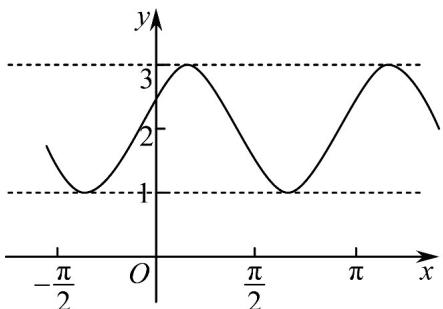
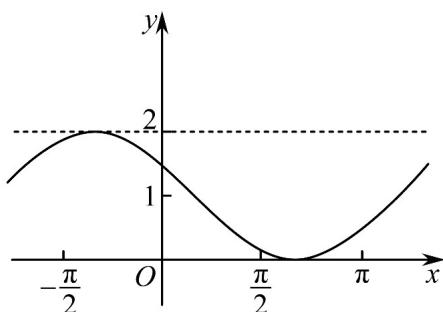

> [!faq]- 《专题15_三角函数图像变换高频题型精准突破_八大题型__高效培优期末专》官方解析
>
> > [!success]- **【答案】**  图1  图2 A. $x = \frac{k\pi}{2} +\frac{\pi}{6} (k\in \mathbf{Z})$ B. $x = k\pi + \frac{\pi}{3} (k \in \mathbf{Z})$ C. $x = \frac{k\pi}{2} -\frac{\pi}{6} (k\in \mathbf{Z})$ D. $x = k\pi -\frac{\pi}{3} (k\in \mathbf{Z})$
>
> > [!note]- **【解析】**
> > 根据图象变换，分 $\omega=1,\quad\omega=2$ ，结合图象讨论求解
> >
> > 【详解】若 $f(x)$ 的图象是图 $^{2}$ 。由平移变换知： $\omega=1$ ，则 $f(x)=\sin\left(x+\frac{\pi}{6}\right)+1$ ，
> > 令 $x+\frac{\pi}{6}=k\pi+\frac{\pi}{2}(k\in\mathbf{Z})$ ，得 $x=k\pi+\frac{\pi}{3}(k\in\mathbf{Z})$ 。这与图象不符。
> > 若 $f(x)$ 的图象是图 $^{1}$ 。由平移变换知： $\omega=2$ ，则 $f(x)=\sin\left(2x+\frac{\pi}{6}\right)+2$ ，
> > 令 $2x + \frac{\pi}{6} = k\pi + \frac{\pi}{2}(k \in \mathbf{Z})$ ，得 $x = \frac{k\pi}{2} + \frac{\pi}{6}(k \in \mathbf{Z})$ 。符合题意。
> > 故选：A.
> >
> > 11. 要得到函数 $y = \sqrt{3} \sin \left(2x + \frac{\pi}{4}\right) + 2$ 的图象只需将函数 $y = \sqrt{3} \cos \left(2x - \frac{\pi}{2}\right)$ 的图象（）
> >
> > 【答案】
> > A．先向右平移 $\frac{\pi}{8}$ 个单位长度，再向下平移 $^{2}$ 个单位长度
> > B．先向左平移 $\frac{\pi}{8}$ 个单位长度，再向上平移 $^{2}$ 个单位长度
> > C．先向右平移 $\frac{\pi}{4}$ 个单位长度，再向下平移 $^{2}$ 个单位长度
> > D．先向左平移 $\frac{\pi}{4}$ 个单位长度，再向上平移 $^{2}$ 个单位长度
> >
> > 【答案】B
> >
> > 【解析】根据三角函数图像平移规则，进行平移即可
> >
> > 【详解】解：由函数 $y = \sqrt{3}\sin \left(2x + \frac{\pi}{4}\right) + 2 = \sqrt{3}\sin 2\left(x + \frac{\pi}{8}\right) + 2$ ， $y = \sqrt{3}\cos \left(2x - \frac{\pi}{2}\right) = \sqrt{3}\sin 2x$
> >
> > 所以先向左平移 $\frac{\pi}{8}$ 个单位长度，得 $y = \sqrt{3}\sin 2(x + \frac{\pi}{8}) = \sqrt{3}\sin (2x + \frac{\pi}{4})$ 的图像，再向上平移2个单位长度，得 $y = \sqrt{3}\sin \left(2x + \frac{\pi}{4}\right) + 2$ 的图像，
> >
> > 故选 **B**
