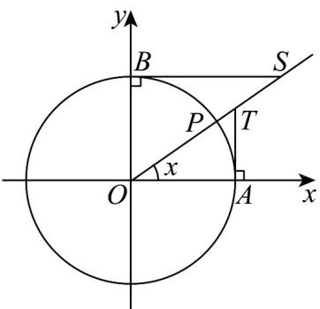

> [!faq]- 《专题15_三角函数图像变换高频题型精准突破_八大题型__高效培优期末专》官方解析
>
> > [!success]- **【答案】**  <!-- source-part:2 pages:51-62 --> A. $\cot x = OT$ B. $\cot x = PS$ C. $\cot x = OS$ D. $\cot x = BS$
>
> > [!note]- **【分析】**
> > 利用三角形相似，即可求解·
>
> > [!note]- **【解析】**
> > 由图象可知， $\triangle OBS \sim \triangle TAO$
> >
> > 则 $\frac{OB}{AT} = \frac{BS}{OA}$ ，即 $BS\cdot AT = OB\cdot OA = 1$
> >
> > 所以 $BS = \frac{1}{AT} = \frac{1}{\tan x} = \cot x$ .
> >
> > 故选 **D**
