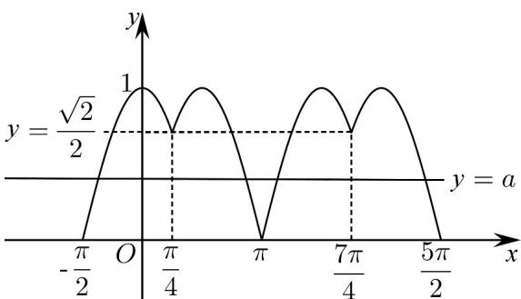

> [!faq]- 《专题15_三角函数图像变换高频题型精准突破_八大题型__高效培优期末专》官方解析
>
> > [!success]- **【答案】** (1) $y = \sin \frac{4}{3} x$ 不是“ $M$ 函数”，理由见解析 $$ f (x) = \left\{ \begin{array}{l} \cos \left(x - \frac {3}{2} k \pi\right), x \in \left[ \frac {3}{2} k \pi - \frac {\pi}{2}, \frac {3}{2} k \pi + \frac {\pi}{4}\right), k \in Z \\ \sin \left(x - \frac {3}{2} k \pi\right), x \in \left[ \frac {3}{2} k \pi + \frac {\pi}{4}, \frac {3}{2} k \pi + \pi \right], k \in Z \end{array} \right. $$ $$ \left[ \frac {\pi}{4}, \frac {\pi}{2} \right] ^ {\prime} \left[ \pi , \frac {3 \pi}{2}\right) ^ {\prime} $$ $$ S = \left\{ \begin{array}{l} 3 \pi , a = 0 \\ 4 \pi , a \in \left(0, \frac {\sqrt {2}}{2}\right) \cup \{1 \} \\ 6 \pi , a = \frac {\sqrt {2}}{2} \\ 8 \pi , a \in \left(\frac {\sqrt {2}}{2}, 1\right) \end{array} \right. \tag {3} $$
>
> > [!note]- **【分析】**
> > （1）根据题干条件代入检验，得到 $f\left(\frac{\pi}{4} + x\right) \neq f\left(\frac{\pi}{4} - x\right)$ ，故 $y = \sin \frac{4}{3} x$ 不是“ $M$ 函数”；
> >
> > (2) 求出函数的周期 $T = \frac{3\pi}{2}$ ，由 $f\left(\frac{\pi}{4} + x\right) = f\left(\frac{\pi}{4} - x\right)$ 得到 $f(x) = f\left(\frac{\pi}{2} - x\right)$ ，结合当 $x \in \left[\frac{\pi}{4}, \pi\right]$ 时， $y = \sin x$ ，从而得到函数解析式，并求出单调递增区间；
> >
> > (3) 画出 $f(x)$ 在 $\left[-\frac{\pi}{2}, \frac{5\pi}{2}\right]$ 上图象，数形结合，由函数的对称性，分四种情况进行求解，得到 $\mathbf{S}$
>
> > [!note]- **【解析】**
> > （1） $y = \sin \frac{4}{3} x$ 不是“ $M$ 函数”，理由如下：
> >
> > $$
> > f \left(x + \frac {3 \pi}{2}\right) = \sin \frac {4}{3} \left(x + \frac {3 \pi}{2}\right) = \sin \left(\frac {4}{3} x + 2 \pi\right) = \sin \frac {4}{3} x = f (x),
> > $$
> >
> > $$
> > f \left(\frac {\pi}{4} + x\right) = \sin \frac {4}{3} \left(\frac {\pi}{4} + x\right) = \sin \left(\frac {\pi}{3} + \frac {4}{3} x\right), f \left(\frac {\pi}{4} - x\right) = \sin \frac {4}{3} \left(\frac {\pi}{4} - x\right) = \sin \left(\frac {\pi}{3} - \frac {4}{3} x\right),
> > $$
> >
> > 则 $f\left(\frac{\pi}{4} + x\right) \neq f\left(\frac{\pi}{4} - x\right)$
> >
> > 故 $y = \sin \frac{4}{3} x$ 不是“M 函数”；
> >
> > (2) 函数 $f(x)$ 满足 $f(x)=f\left(x+\frac{3\pi}{2}\right)$ ，故 $f(x)$ 的周期为 $T=\frac{3\pi}{2}$ ，
> >
> > 因为 $f\left(\frac{\pi}{4} + x\right) = f\left(\frac{\pi}{4} - x\right)$
> >
> > 所以 $f(x)=f\left(\frac{\pi}{2}-x\right)$
> >
> > 当 $x \in \left[\frac{3}{2} k\pi + \frac{\pi}{4}, \frac{3}{2} k\pi + \pi\right]$ 时， $f(x) = f\left(x - \frac{3}{2} k\pi\right) = \sin\left(x - \frac{3}{2} k\pi\right)$ ， $k \in \mathbb{Z}$ ，
> >
> > 当 $x \in \left[\frac{3}{2} k\pi - \frac{\pi}{2}, \frac{3}{2} k\pi + \frac{\pi}{4}\right)$ 时， $f(x) = f\left[\frac{\pi}{2} - \left(x - \frac{3}{2} k\pi\right)\right] = \sin \left[\frac{\pi}{2} - \left(x - \frac{3}{2} k\pi\right)\right] = \cos \left(x - \frac{3}{2} k\pi\right)$ ， $k \in \mathbb{Z}$ ，
> >
> > 综上： $f(x) = \left\{ \begin{array}{ll}\cos \left(x - \frac{3}{2} k\pi\right),x\in \left[\frac{3}{2} k\pi -\frac{\pi}{2},\frac{3}{2} k\pi +\frac{\pi}{4}\right),k\in Z\\ \sin \left(x - \frac{3}{2} k\pi\right),x\in \left[\frac{3}{2} k\pi +\frac{\pi}{4},\frac{3}{2} k\pi +\pi \right],k\in Z \end{array} \right.$
> >
> > $f(x) = \sin \left(x - \frac{3}{2} k\pi\right), x \in \left[\frac{3}{2} k\pi + \frac{\pi}{4}, \frac{3}{2} k\pi + \pi\right], k \in Z$ 中，
> >
> > 当 $k = 0$ 时， $x \in \left[\frac{\pi}{4}, \pi\right]$ ， $f(x) = \sin x$ ，此时单调递增区间为 $\left[\frac{\pi}{4}, \frac{\pi}{2}\right]$ ，
> >
> > $f(x) = \cos \left(x - \frac{3}{2} k\pi\right), x \in \left[\frac{3}{2} k\pi - \frac{\pi}{2}, \frac{3}{2} k\pi + \frac{\pi}{4}\right), k \in Z$ 中
> >
> > 当 $k = 1$ 时， $x \in \left[\pi, \frac{7\pi}{4}\right)$ ， $f(x) = \cos \left(x - \frac{3}{2}\pi\right)$ ，
> >
> > 则 $x - \frac{3}{2}\pi \in \left[-\frac{1}{2}\pi ,\frac{\pi}{4}\right)$
> >
> > 当 $x - \frac{3}{2}\pi \in \left[-\frac{1}{2}\pi ,0\right)$ ，即 $x\in \left[\pi ,\frac{3}{2}\pi\right)$ 时，函数单调递增，
> >
> > 经检验，其他范围不是单调递增区间，
> >
> > 所以在 $\left[0, \frac{3\pi}{2}\right]$ 上的单调递增区间为 $\left[\frac{\pi}{4}, \frac{\pi}{2}\right]$ ， $\left[\pi, \frac{3\pi}{2}\right)$ ；
> >
> > (3) 由 (2) 知：函数 $f(x)$ 在 $\left[-\frac{\pi}{2}, \frac{5\pi}{2}\right]$ 上图象为：
> >
> > 
> >
> > 当 $a = 0$ 时， $f(x) = a$ 有3个解，其和为 $-\frac{\pi}{2} + \frac{7\pi}{4} \times 2 = 3\pi$ 当 $0 < a < \frac{\sqrt{2}}{2}$ 或 1 时， $f(x) = a$ 有 4 个解，由对称性可知：其和为 $\frac{\pi}{4} \times 2 + \frac{7\pi}{4} \times 2 = 4\pi$ ，当 $a = \frac{\sqrt{2}}{2}$ 时， $f(x) = a$ 有 6 个解，由对称性可知：其和为 $\frac{\pi}{4} \times 2 + \frac{7\pi}{4} \times 2 + \frac{\pi}{4} + \frac{7\pi}{4} = 6\pi$ ，当 $\frac{\sqrt{2}}{2} < a < 1$ 时， $f(x) = a$ 有 8 个解，其和为 $0 \times 2 + \frac{\pi}{2} \times 2 + \frac{3\pi}{2} \times 2 + 2\pi \times 2 = 8\pi$ ，所以 $S = \begin{cases} 3\pi, a = 0 \\ 4\pi, a \in \left(0, \frac{\sqrt{2}}{2}\right) \cup \{1\} \\ 6\pi, a = \frac{\sqrt{2}}{2} \\ 8\pi, a \in \left(\frac{\sqrt{2}}{2}, 1\right) \end{cases}$ .
