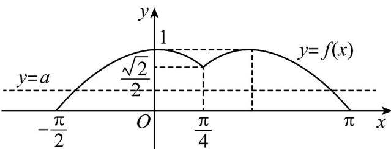

> [!faq]- 《专题15_三角函数图像变换高频题型精准突破_八大题型__高效培优期末专》官方解析
>
> > [!success]- **【答案】** (1)不是，理由见解析 (2)答案见解析 (3) $S(3) = \begin{cases} 7\pi, a = 0 \\ 20\pi, 0 < a < \frac{\sqrt{2}}{2} \text{或} a = 1 \\ 30\pi, a = \frac{\sqrt{2}}{2} \\ 40\pi, \frac{\sqrt{2}}{2} < a < 1 \end{cases}$
>
> > [!note]- **【分析】**
> > （1）根据“M 函数”的定义判断可得出结论；
> >
> > (2) 分析可知函数 $f(x)$ 是周期为 $\frac{3\pi}{2}$ 的周期函数，且 $f(x) = f\left(\frac{\pi}{2} - x\right)$ ，分 $x \in \left[\frac{3k\pi}{2} + \frac{\pi}{4}, \frac{3k\pi}{2} + \pi\right] (k \in \mathbb{Z})$ $x \in \left[\frac{3k\pi}{2} - \frac{\pi}{2}, \frac{3k\pi}{2} + \frac{\pi}{4}\right] (k \in \mathbb{Z})$ 两种情况分析，结合题意可出函数 $f(x)$ 的解析式，进而可得出函数 $f(x)$ $\left[0, \frac{3\pi}{2}\right]$ 上的单调递增区间；
> >
> > （3）作出函数 $f(x)$ 在 $\left[-\frac{\pi}{2},\pi\right]$ 上的图象，数形结合可得实数 $a$ 在不同取值下，方程 $f(x)=a$ 的根之和，再结合函数 $f(x)$ 的周期性可求得 $S(3)$ 的值.
>
> > [!note]- **【解析】**
> > （1）解：函数 $f(x) = \sin \frac{4x}{3}$ 不是为“ $M$ 函数”，理由如下：
> >
> > 因为 $f\left(\frac{\pi}{4} + x\right) = \sin \left[\frac{4}{3}\left(\frac{\pi}{4} + x\right)\right] = \sin \left(\frac{\pi}{3} + \frac{4x}{3}\right)$
> >
> > $f\left(\frac{\pi}{4} -x\right) = \sin \left[\frac{4}{3}\left(\frac{\pi}{4} -x\right)\right] = \sin \left(\frac{\pi}{3} -\frac{4x}{3}\right)$ ，所以， $f\left(\frac{\pi}{4} +x\right)\neq f\left(\frac{\pi}{4} -x\right)(x\in \mathrm{R})$
> >
> > 因此，函数 $f(x) = \sin \frac{4x}{3}$ 不是为“ $M$ 函数”
> >
> > (2) 解：函数 $f(x)$ 满足 $f(x)=f\left(x+\frac{3\pi}{2}\right)$ ，所以，函数 $f(x)$ 为周期函数，且周期为 $T=\frac{3\pi}{2}$ ，
> >
> > 因为 $f\left(\frac{\pi}{4} + x\right) = f\left(\frac{\pi}{4} - x\right)(x \in \mathbb{R})$ ，则 $f(x) = f\left(\frac{\pi}{2} - x\right)(x \in \mathbb{R})$ .
> > - **①**：当 $x \in \left[\frac{3k\pi}{2} + \frac{\pi}{4}, \frac{3k\pi}{2} + \pi\right](k \in \mathbb{Z})$ 时， $x - \frac{3k\pi}{2} \in \left[\frac{\pi}{4}, \pi\right](k \in \mathbb{Z})$
> >
> > 则 $f(x) = f\left(x - \frac{3k\pi}{2}\right) = \sin \left(x - \frac{3k\pi}{2}\right)(k\in \mathbb{Z})$
> > - **②**：当 $x \in \left[\frac{3k\pi}{2} - \frac{\pi}{2}, \frac{3k\pi}{2} + \frac{\pi}{4}\right](k \in \mathbb{Z})$ ，则 $x - \frac{3k\pi}{2} \in \left[-\frac{\pi}{2}, \frac{\pi}{4}\right](k \in \mathbb{Z})$ ，
> >
> > 则 $\frac{\pi}{2}-\left(x-\frac{3k\pi}{2}\right)\in\left[\frac{\pi}{4},\pi\right](k\in\mathbb{Z})$ ，
> >
> > 所以， $f(x) = f\left[\frac{\pi}{2} -\left(x - \frac{3k\pi}{2}\right)\right] = \sin \left[\frac{\pi}{2} -\left(x - \frac{3k\pi}{2}\right)\right] = \cos \left(x - \frac{3k\pi}{2}\right)(k\in Z).$
> >
> > 综上所述， $f(x) = \left\{ \begin{array}{l}\cos \left(x - \frac{3k\pi}{2}\right),\frac{3k\pi}{2} -\frac{\pi}{2}\leq x\leq \frac{3k\pi}{2} +\frac{\pi}{4}\big(k\in Z\big)\\ \sin \left(x - \frac{3k\pi}{2}\right),\frac{3k\pi}{2} +\frac{\pi}{4} <  x\leq \frac{3k\pi}{2} +\pi (k\in Z)\end{array} \right.$
> >
> > 所以，函数 $f(x)$ 在 $\left[0, \frac{3\pi}{2}\right]$ 上的单调递增区间为 $\left(\frac{\pi}{4}, \frac{\pi}{2}\right)$ 、 $\left[\pi, \frac{3\pi}{2}\right]$ .
> >
> > (3) 解：由 (2) 可得函数 $f(x)$ 在 $\left[-\frac{\pi}{2}, \pi\right]$ 上的图象如下图所示，
> >
> > 
> >
> > 下面考虑方程 $f(x) = a$ 在区间 $\left[-\frac{\pi}{2}, \pi\right]$ 的根之和
> > - **①**：当 $0 \leq a < \frac{\sqrt{2}}{2}$ 或 $a = 1$ 时，方程 $f(x) = a$ 有两个实数解，其和为 $\frac{\pi}{2}$ ；
> > - **②**：当 $a = \frac{\sqrt{2}}{2}$ 时，方程 $f(x) = a$ 有三个实数解，其和为 $\frac{3\pi}{4}$ ；
> > - **③**：当 $\frac{\sqrt{2}}{2} < a < 1$ 时，方程 $f(x) = a$ 有四个实数解，其和为 $\pi$
> >
> > 当 $x \in \left[-\frac{\pi}{2}, \frac{3k\pi}{2} + \pi\right](k \in \mathbb{N})$ 时，关于 $x$ 的方程 $f(x) = a$ （ $a$ 为常数）有解，记该方程所有解的和为 $S(k)$ ，
> >
> > 所以，当 $a = 0$ 时， $S(3) = -\frac{\pi}{2} \times 4 + \frac{3\pi}{2} \times (1 + 2 + 3) = 7\pi$ ；
> >
> > 当 $0 < a < \frac{\sqrt{2}}{2}$ 或 $a = 1$ 时， $S(3) = 2 \times \left[\frac{\pi}{4} \times 4 + \frac{3\pi}{2} \times (1 + 2 + 3)\right] = 20\pi$ ；
> >
> > 当 $a = \frac{\sqrt{2}}{2}$ 时， $S(3) = 3 \times \left[\frac{\pi}{4} \times 4 + \frac{3\pi}{2} \times (1 + 2 + 3)\right] = 30\pi$ ；
> >
> > 当 $\frac{\sqrt{2}}{2} < a < 1$ 时， $S(3) = 4 \times \left[\frac{\pi}{4} \times 4 + \frac{3\pi}{2} \times (1 + 2 + 3)\right] = 40\pi$ 。
> >
> > 【详解】
> >
> > 因此， $S(3)=\left\{\begin{aligned}&7\pi,a=0\\ &20\pi,0<a<\frac{\sqrt{2}}{2}\text{或}a=1\\ &30\pi,a=\frac{\sqrt{2}}{2}\\ &40\pi,\frac{\sqrt{2}}{2}<a<1\end{aligned}\right.$
