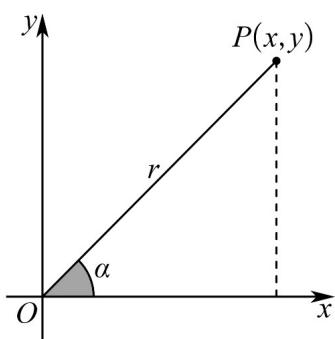

> [!faq]- 《专题15_三角函数图像变换高频题型精准突破_八大题型__高效培优期末专》官方解析
>
> > [!success]- **【答案】** ②④⑤
>
> > [!note]- **【分析】**
> > 由题设新定义知： $\sec \alpha = \frac{1}{\cos\alpha}$ ， $\csc \alpha = \frac{1}{\sin\alpha}$ ， $\cot \alpha = \frac{1}{\tan\alpha}$ ，由 $\cot \frac{3\pi}{4} = \frac{1}{\tan\frac{3\pi}{4}}$ 、 $\sin \alpha \cdot \csc \alpha = \sin \alpha \cdot \frac{1}{\sin\alpha}$ 、 $y = \sec x = \frac{1}{\cos x}$ 、 $\sec^2\alpha +\csc^2\alpha = \frac{4}{\sin^22\alpha}$ 以及正切二倍角公式，即可判断各项的
>
> > [!note]- **【解析】**
> > 正误·
> > 
> > - **①**：$\cot \frac{3\pi}{4} = \frac{1}{\tan \frac{3\pi}{4}} = -1$ ，故错误；
> > - **②**：$\sin\alpha\cdot\csc\alpha=\sin\alpha\cdot\frac{1}{\sin\alpha}=1$ ，故正确；
> > - **③**：$y = \sec x = \frac{1}{\cos x}$ ，即 $\cos x \neq 0$ ，有 $\left\{x \mid x \neq k\pi + \frac{\pi}{2}, k \in \mathbb{Z}\right\}$ ，故错误；
> > - **④**：$\sec^2\alpha +\csc^2\alpha = \frac{1}{\cos^2\alpha} +\frac{1}{\sin^2\alpha} = \frac{1}{\cos^2\alpha\sin^2\alpha} = \frac{4}{\sin^2 2\alpha}$ 4，故正确；
> > - **⑤**：$\cot 2\alpha = \frac{1}{\tan 2\alpha}, \tan 2\alpha = \frac{2\tan\alpha}{1 - \tan^2\alpha}$ ，所以 $\cos 2\alpha = \frac{1 - \tan^2\alpha}{2\tan\alpha} = \frac{\cot^2\alpha - 1}{2\cot\alpha}$ ，故正确·
> > ## 故答案为：②④⑤
