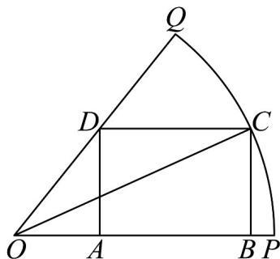

> [!faq]- 《专题15_三角函数图像变换高频题型精准突破_八大题型__高效培优期末专》官方解析
>
> > [!success]- **【答案】** A. $-\frac{\pi}{3}$ B. $-\frac{\pi}{6}$ C. $\frac{\pi}{6}$ D. $\frac{\pi}{3}$
>
> > [!note]- **【分析】**
> > 先利用两角和的余弦公式及辅助角公式将函数 $f(x)$ 化简，再根据三角函数的性质求出最大值，最后结合已知条件求出 $\varphi$ 的值.
>
> > [!note]- **【解析】**
> > $f(x) = \sin x + \cos (x + \varphi) = \sin x + \cos x\cos \varphi -\sin x\sin \varphi = (1 - \sin \varphi)\sin x + \cos \varphi \cos x$ 令 $\cos \theta = \frac{1 - \sin\varphi}{\sqrt{(1 - \sin\varphi)^2 + \cos^2\varphi}}$ $\sin \theta = \frac{\cos\varphi}{\sqrt{(1 - \sin\varphi)^2 + \cos^2\varphi}}$
> >
> > 则 $f(x) = \sqrt{(1 - \sin\varphi)^2 + \cos^2\varphi} (\sin x\cos \theta +\cos x\sin \theta) = \sqrt{(1 - \sin\varphi)^2 + \cos^2\varphi}\cdot \sin (x + \theta)$
> >
> > 因为 $x \in \mathbf{R}$ ， $-1 \leq \sin (x + \theta) \leq 1$ ，所以 $f(x)$ 的最大值为 $\sqrt{(1 - \sin \varphi)^2 + \cos^2 \varphi}$
> >
> > 从而 $\sqrt{(1 - \sin\varphi)^2 + \cos^2\varphi} = 1$ ，即 $(1 - \sin \varphi)^2 +\cos^2\varphi = 1$ ，则 $\sin \varphi = \frac{1}{2}$
> >
> > 因为 $-\frac{\pi}{2}<\varphi<\frac{\pi}{2}$ ，所以 $\varphi=\frac{\pi}{6}$ 。
> >
> > 故选：C
> >
> > 35. 剪纸是中国传统民间艺术，起源于汉朝，具有构图饱满、造型夸张、题材广泛、地域风格多样等艺术特点·现需在半径 $R = 1$ ，面积为 $\frac{\pi}{6}$ 的扇形纸张内剪一个矩形 $ABCD$ ，如图所示， $C$ 是扇形弧上的动点， $D$ 在线段 $OQ$ 上， $A, B$ 均在线段 $OP$ 上。
> >
> > 
> >
> > (1)求圆心角 $\angle POQ$ 的大小（用弧度表示）；
> >
> > (2)设 $\angle POC = \theta$ ，且 $\sin (\angle POQ - \theta) = \frac{3}{5}$ ，求 $BC$ 的长；
> >
> > (3)求矩形ABCD面积的最大值·
> >
> > 【答案】(1) $\frac{\pi}{3}$
> >
> > (2) $\frac{4\sqrt{3}-3}{10}$
> >
> > (3) $\frac{\sqrt{3}}{6}$
> >
> > 【分析】（1）由扇形的面积公式建立方程，即可求出圆心角的大小；
> >
> > (2) 由 (1) 知 $\angle POQ$ ，代入条件得到 $\sin\left(\frac{\pi}{3}-\theta\right)$ 的值，由平方和关系求得 $\cos\left(\frac{\pi}{3}-\theta\right)$ ，然后由和差角公式求得 $\sin\theta$ ，从而求得 $BC$ 的长；
> >
> > $$
> > A B C D
> > $$
> >
> > (3) 设 $\angle POC = \theta$ ，由直角三角形边角的关系分别表示出 $BC, AB$ 边长，然后表示出短利用二倍角公式和辅助角公式化简，再利用正弦函数性质求出最大值。
> >
> > 【详解】（1）设扇形的圆心角 $\angle POQ = \alpha$ ，由扇形的面积 $S = \frac{1}{2} \alpha R^2$ ，得 $\frac{\pi}{6} = \frac{1}{2} \alpha$ ，所以 $\angle POQ = \alpha = \frac{\pi}{3}$ .
> >
> > (2) 由 (1) 知， $\angle POQ = \frac{\pi}{3}$ ，则 $\sin (\angle POQ - \theta) = \sin (\frac{\pi}{3} - \theta) = \frac{3}{5}$ ，由 $\frac{\pi}{3} - \theta \in (0, \frac{\pi}{2})$ ，得 $\cos (\frac{\pi}{3} - \theta) = \sqrt{1 - \sin^2 (\frac{\pi}{3} - \theta)} = \frac{4}{5}$ ，因此 $\sin \theta = \sin [\frac{\pi}{3} - (\frac{\pi}{3} - \theta)] = \sin \frac{\pi}{3} \cos (\frac{\pi}{3} - \theta) - \cos \frac{\pi}{3} \sin (\frac{\pi}{3} - \theta) = \frac{\sqrt{3}}{2} \times \frac{4}{5} - \frac{1}{2} \times \frac{3}{5} = \frac{4\sqrt{3} - 3}{10}$ 所以 $BC = OC \cdot \sin \theta = \frac{4\sqrt{3} - 3}{10}$ .
> >
> > (3) 设 $\angle POC = \theta$ ，在 Rt△ OBC 中， $BC = OC \cdot \sin \theta = \sin \theta$ ， $OB = OC \cdot \cos \theta = \cos \theta$ 在 Rt△ OAD 中， $OA = \frac{AD}{\tan \angle POQ} = \frac{\sin \theta}{\tan \frac{\pi}{3}} = \frac{\sqrt{3} \sin \theta}{3}$ ，则 $AB = OB - OA = \cos \theta - \frac{\sqrt{3} \sin \theta}{3}$ ，因此矩形 ABCD 的面积 $S = AB \cdot BC = (\cos \theta - \frac{\sqrt{3} \sin \theta}{3})\sin \theta = \cos \theta\sin\theta - \frac{\sqrt{3}\sin^2\theta}{3} = \frac{1}{2}\sin 2\theta + \frac{\sqrt{3}}{6}\cos 2\theta - \frac{\sqrt{3}}{6} = \frac{\sqrt{3}}{3}\sin (2\theta +\frac{\pi}{6}) - \frac{\sqrt{3}}{6}$ ，由 $\theta \in (0,\frac{\pi}{3})$ ，得 $2\theta +\frac{\pi}{6}\in (\frac{\pi}{6},\frac{5\pi}{6})$ ，则当 $2\theta +\frac{\pi}{6} = \frac{\pi}{2}$ ，即 $\theta = \frac{\pi}{6}$ 时，矩形 ABCD 的面积取得最大值 $\frac{\sqrt{3}}{6}$ .
