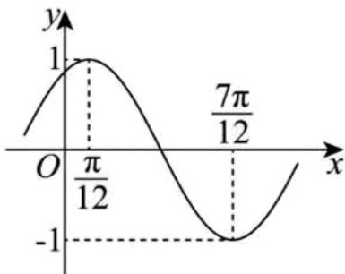

> [!faq]- 《专题15_三角函数图像变换高频题型精准突破_八大题型__高效培优期末专》官方解析
>
> > [!success]- **【答案】**  A $\omega = 2$ B. $\varphi = \frac{\pi}{3}$ C. $y = f\left(x + \frac{\pi}{12}\right)$ 是奇函数 D．当 $x\in [3\pi ,4\pi ]$ 时， $f(x)$ 的图象与 $x$ 轴有2个交点
>
> > [!note]- **【分析】**
> > 根据图象求出 $\omega=2$ 、 $\varphi=\frac{\pi}{3}$ 后可得函数解析式，故可判断 AB 的正误，求出 $f\left(x+\frac{\pi}{12}\right)=\cos2x$ 后可判断 C 的正误，求出 $2x+\frac{\pi}{3}$ 的范围后结合正弦函数的零点可判断 D 的正误。
>
> > [!note]- **【解析】**
> > 由图像可得 $\frac{T}{2} = \frac{7\pi}{12} -\frac{\pi}{12} = \frac{\pi}{2}$ ，故 $T = \pi$ ，故 $\omega = 2$ ，故A正确；
> >
> > 故 $f(x) = \sin(2x + \varphi)$ ，而 $f\left(\frac{\pi}{12}\right) = 1$ ，故 $2 \times \frac{\pi}{12} + \varphi = \frac{\pi}{2} + 2k\pi, k \in \mathbb{Z}$ ，
> >
> > 故 $\varphi = \frac{\pi}{3} + 2k\pi, k \in \mathbb{Z}$ ，而 $|\varphi| < \frac{\pi}{2}$ ，故 $\varphi = \frac{\pi}{3}$ ，故 B 正确；
> >
> > 因为 $f\left(x + \frac{\pi}{12}\right) = \sin \left(2x + \frac{\pi}{6} +\frac{\pi}{3}\right) = \cos 2x$ ，故 $f\left(x + \frac{\pi}{12}\right)$ 为偶函数，故C错误；
> >
> > 故 $f(x) = \sin \left(2x + \frac{\pi}{3}\right)$ ，当 $x \in [3\pi, 4\pi]$ 时， $6\pi + \frac{\pi}{3} \leq 2x + \frac{\pi}{3} \leq 8\pi + \frac{\pi}{3}$ ，
> >
> > 因为 $y = \sin t$ 在 $\left[6\pi +\frac{\pi}{3},8\pi +\frac{\pi}{3}\right]$ 上的零点为 $7\pi ,8\pi$ ，
> >
> > 故 $f(x)$ 在 $[3\pi, 4\pi]$ 上有两个不同的零点，故 ${}^{\mathrm{D}}$ 正确，
> >
> > 故选 **ABD**.
