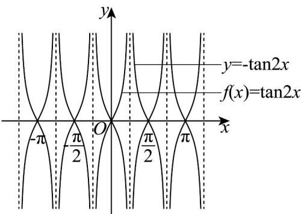
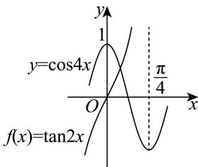

> [!faq]- 《专题15_三角函数图像变换高频题型精准突破_八大题型__高效培优期末专》官方解析
>
> > [!success]- **【答案】** A. $f(x)$ 的最小正周期为 $\frac{\pi}{2}$ B. $f(x)$ 的图象关于点 $\left(\frac{\pi}{4}, 0\right)$ 成中心对称图形 C. $f(x)$ 的图象可以由 $y = -\tan 2x$ 的图象平移得到 D. $f(x)$ 的图象与 $y = \cos 4x$ 的图象在区间 $\left(0, \frac{\pi}{4}\right)$ 上有唯一公共点
>
> > [!note]- **【分析】**
> > 由周期公式即可判断 $^{A}$ ；求出函数的对称中心即可判断 $^{B}$ ；由正切函数图象性质和余弦函数性质树形结合即可判断CD.
>
> > [!note]- **【解析】**
> > 对于 $\mathsf{A}$ ，函数 $f(x)$ 最小正周期为 $T = \frac{\pi}{2}$ ，故 $\mathsf{A}$ 正确；
> >
> > 对于 B，令 $2x=\frac{k\pi}{2}, k\in\in Z \Rightarrow x=\frac{k\pi}{4}, k\in\in Z$ ，所以函数的对称中心为 $\left(\frac{k\pi}{4},0\right), k\in Z$ ，
> >
> > 所以当 $k = 1$ 时得点 $\left(\frac{\pi}{4},0\right)$ 是函数 $f(x)$ 的一个对称中心，故 ${}^{\mathrm{B}}$ 正确；
> >
> > 对于 C，函数 $f(x)=\tan2x$ 图象与 $y=-\tan2x$ 的图象关于 x 轴对称，如图：
> >
> > 
> >
> > 由图象结构性质可知 $f(x)$ 的图象不可以由 $y = -\tan 2x$ 的图象平移得到，故 C 错误；
> >
> > 对于D，因为 $x\in \left(0,\frac{\pi}{4}\right)$ 时， $2x\in \left(0,\frac{\pi}{2}\right),4x\in (0,\pi)$
> >
> > 所以函数 $f(x) = \tan 2x$ 在 $\left(0, \frac{\pi}{4}\right)$ 上单调递增， $y = \cos 4x$ 在 $\left(0, \frac{\pi}{4}\right)$ 上单调递减，
> >
> > 
> >
> > 又当 $x = 0$ 时，代入函数 $f(x) = \tan 2x$ 得 $f(0) = 0$ ，代入 $y = \cos 4x$ 得 $y = 1 > 0$
> >
> > 当 $x = \frac{\pi}{8}$ 时，代入函数 $f(x) = \tan 2x$ 得 $f\left(\frac{\pi}{8}\right) = \tan \frac{\pi}{4} = 1$ ，代入 $y = \cos 4x$ 得 $y = 0 < 1$ ，
> >
> > 所以 $f(x)$ 的图象与 $y = \cos 4x$ 的图象在区间 $\left(0, \frac{\pi}{4}\right)$ 上有唯一公共点，故 ${}^{\mathrm{D}}$ 正确
> >
> > 故选 **ABD**
