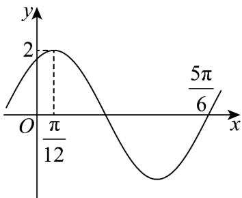

> [!faq]- 《专题15_三角函数图像变换高频题型精准突破_八大题型__高效培优期末专》官方解析
>
> > [!success]- **【答案】**  A. 函数 $y = f(x)$ 的图象关于直线 $x = \frac{\pi}{3}$ 对称 B．若 $\forall x\in\left[-\frac{\pi}{12},\frac{\pi}{4}\right]$ ， $2[f(x)]^{2}-mf(x)-1$ 0 恒成立，则实数 $m\in(-\infty,1]$ C. 函数 $y = f(x)$ 在 $[- \pi, a]$ 内有 5 个零点，则 $a \in \left[\frac{4\pi}{3}, \frac{11\pi}{6}\right)$ . D．若 $F(x)=f(x)-\lambda$ 在 $[0,n\pi]\left(n\in\mathbf{N}^{*}\right)$ 上恰有 2024 个零点，则 n=2024
>
> > [!note]- **【分析】**
> > 由图象先求出 $f(x) = 2\cos \left(2x - \frac{\pi}{6}\right)$ ，再结合选项依次判断即可·
>
> > [!note]- **【解析】**
> > 解：由图象知， $A = 2, \frac{5\pi}{6} - \frac{\pi}{12} = \frac{3}{4} \times \frac{2\pi}{\omega}$ ，得 $\omega = 2$ ，
> >
> > 由 $2 \times \frac{\pi}{12} + \varphi = 2k\pi, k \in \mathbb{Z}$ ，而 $|\varphi| < \frac{\pi}{2}$ ，得 $\varphi = -\frac{\pi}{6}$ ，
> >
> > 故 $f(x)=2\cos(2x-\frac{\pi}{6})$ ，
> >
> > 对于 A 项，由 $2x - \frac{\pi}{6} = k\pi, k \in Z$ ，得 $x = \frac{\pi}{12} + \frac{k\pi}{2}, k \in Z$ ，则 $x = \frac{\pi}{3}$ ，不满足 $k \in Z$ ，故 A 项错误；
> >
> > 对于 B 项，由 $x \in \left[-\frac{\pi}{12}, \frac{\pi}{4}\right]$ ，得 $2x - \frac{\pi}{6} \in \left[-\frac{\pi}{3}, \frac{\pi}{3}\right]$ ，得 $f(x) \in [1, 2]$ ，
> >
> > 令 $t = f(x)$ ，由 $2[f(x)]^{2} - mf(x) - 1 \quad 0$ ，得 $2t^{2} - mt - 1 \quad 0$ ，
> >
> > 而 $t \in [1,2]$ ，得 $m \leq 2t - \frac{1}{t}$ 在 $t \in [1,2]$ 上恒成立，
> >
> > 由 $y = 2t - \frac{1}{t}$ 在 $[1,2]$ 上单调递增，则 $y_{\min} = 2 \times 1 - \frac{1}{1} = 1$ ，
> >
> > 得 $m \leq 1$ ，故 $\mathsf{B}$ 项正确；
> >
> > 对于 $^{C}$ 项，由 $x\in[-\pi,a]$ ，得 $2x-\frac{\pi}{6}\in\left[-2\pi-\frac{\pi}{6},2a-\frac{\pi}{6}\right]$ ，
> >
> > 因为函数 $y = f(x)$ 在 $[- \pi, a]$ 内有 $^5$ 个零点，所以 $\frac{5\pi}{2} \leq 2a - \frac{\pi}{6} < \frac{7\pi}{2}$ ，得 $\frac{4\pi}{3} \leq a < \frac{11\pi}{6}$ ，故 $^C$ 项正确；对于 $^D$ 项，令 $F(x) = f(x) - \lambda = 0$ ，得 $\lambda = f(x)$ ，
> >
> > 若 $F(x) = f(x) - \lambda$ 在 $[0, n\pi]\left(n \in \mathbf{N}^*\right)$ 上恰有2024个零点，
> >
> > 转化为函数 $y = f(x)$ 和 $y = \lambda$ 在 $[0, n\pi] \left( n \in \mathbf{N}^{*} \right)$ 上恰有 2024 个交点，
> >
> > 当 $n = 2024$ 时，由 $x \in [0, 2024\pi]$ ，得 $2x - \frac{\pi}{6} \in \left[-\frac{\pi}{6}, 4048\pi - \frac{\pi}{6}\right]$ ，
> >
> > 得 $f(x) \in [-2, 2]$ ,
> >
> > 当 $\lambda = -1$ 时，函数 $y = f(x)$ 和 $y = \lambda$ 在 $[0, 2024\pi]$ 上恰有 4048 个交点，故 D 项错误.
> >
> > 故选 **BC**
