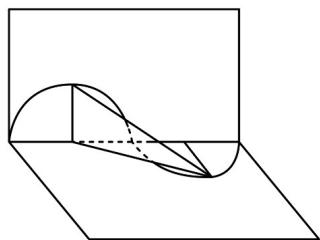

> [!faq]- 《专题15_三角函数图像变换高频题型精准突破_八大题型__高效培优期末专》官方解析
>
> > [!success]- **【答案】** C
>
> > [!note]- **【分析】**
> > 先由 $f(x)=2\sin(\omega x+\varphi)-1$ 与直线 y=1 的两个交点的横坐标分别为 $x_{1}$ ， $x_{2}$ ，且 $|x_{1}-x_{2}|$ 的最小值为 $2\pi$ ，可得最小正周期为 $2\pi$ ，可求出 $\omega$ ，再由图像关于 $(- \frac{\pi}{4}, -1)$ 对称，代入可求出 $\varphi$ ，则可判断 A，B. 再利用三角函数性质分别可判断 C，D.
>
> > [!note]- **【解析】**
> > 由题意知， $2\sin(\omega x+\varphi)-1=1$ ，得 $\sin(\omega x+\varphi)=1$ ，
> >
> > 此时 $|x_{1}-x_{2}|$ 的最小值为 $2\pi$ ，即 $T=2\pi, \therefore \frac{2\pi}{\omega}=2\pi, \therefore \omega=1$ ，
> >
> > 得 $f(x) = 2\sin (x + \varphi) - 1$
> >
> > $\because f(x)$ 的图像关于 $(- \frac{\pi}{4}, -1)$ 对称， $\therefore -\frac{\pi}{4} + \varphi = k\pi, k \in \mathbb{Z}, \therefore \varphi = k\pi + \frac{\pi}{4}, k \in \mathbb{Z}$ ， $\because |\varphi| < \frac{\pi}{2}$ ，所以当 $k = 0$ 时， $\varphi = \frac{\pi}{4}$ ，则 $f(x) = 2\sin (x + \frac{\pi}{4}) - 1$ ，当 $x \in [\frac{\pi}{4}, \frac{\pi}{3}], x + \frac{\pi}{4} \in [\frac{\pi}{2}, \frac{7\pi}{12}]$ ，此时 $f(x)$ 为减函数，故 $C$ 正确。当 $x \in [0, \frac{\pi}{2}]$ 时， $x + \frac{\pi}{4} \in [\frac{\pi}{4}, \frac{3\pi}{4}]$ ，则当 $x + \frac{\pi}{4} = \frac{\pi}{4}$ 或 $\frac{3\pi}{4}$ 时，函数 $f(x)$ 取得最小值，最小值为 $2\sin \frac{\pi}{4} - 1 = \sqrt{2} - 1$ ，故 $D$ 错误。
> >
> > 55. 一纸片上绘有函数 $f(x) = 2\sin \left(\omega x - \frac{\pi}{6}\right) (\omega > 0)$ 一个周期的图像，现将该纸片沿 $x$ 轴折成直二面角，此时原图像上相邻的最高点和最低点的空间距离为 $2\sqrt{3}$ ，若方程 $f(x) = -1$ 在区间 $(0, a)$ 上有两个实根，则实数 $a$ 的取值范围是（）A. $\left[\frac{8}{3}, 4\right)$ B. $\left(\frac{8}{3}, 4\right]$ C. $\left[4, \frac{20}{3}\right)$ D. $\left(4, \frac{20}{3}\right]$
> >
> > 【答案】D
> >
> > 【分析】由原图像上相邻的最高点和最低点的空间距离得出 $\omega$ ，再由正弦函数的性质得出实数 $a$ 的取值范围· 【详解】原图像上相邻的最高点和最低点的空间距离为 $\sqrt{2^2 + \left(\frac{1}{2} \cdot \frac{2\pi}{\omega}\right)^2 + (2)^2} = 2\sqrt{3}$ ， $\therefore \omega = \frac{\pi}{2}$ ，故 $f(x) = 2\sin \left(\frac{\pi}{2} x - \frac{\pi}{6}\right)$ ，方程 $f(x) = -1$ 在区间 $(0, a)$ 上有两个实根，即 $2\sin \left(\frac{\pi}{2} x - \frac{\pi}{6}\right) = -1$ 有 2 个解，由于 $\frac{\pi}{2} x - \frac{\pi}{6} \in \left(-\frac{\pi}{6}, \frac{a\pi}{2} - \frac{\pi}{6}\right)$ ，
> >
> > $\therefore \frac{11\pi}{6} < \frac{a\pi}{2} - \frac{\pi}{6} \leq \frac{19\pi}{6}$ ，则 $4 < a \leq \frac{20}{3}$ .
> >
> > 
> >
> > 故选 **D**
