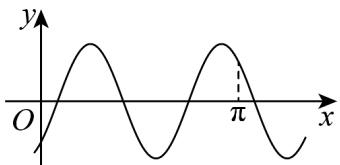
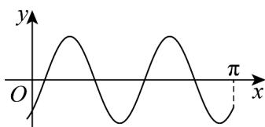
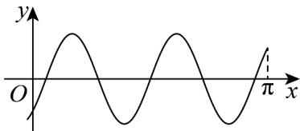

> [!faq]- 《专题15_三角函数图像变换高频题型精准突破_八大题型__高效培优期末专》官方解析
>
> > [!success]- **【答案】** ③④
>
> > [!note]- **【分析】**
> > 对于①②：作出符合题意的图像，利用图像否定结论；
> >
> > 对于④：根据 $f(x)$ 在区间 $[0, \pi]$ 上的图象有且仅有 $^2$ 个最高点，列不等式，解得 $\omega$ 的范围；
> >
> > 对于③：利用复合函数的单调性法则进行判断·
>
> > [!note]- **【解析】**
> > - **对于①**：作出 $f(x) = \sin \left( \omega x - \frac{\pi}{4} \right) (\omega > 0)$ 的图像如图所示：
> >
> > 
> > 图1
> >
> > 
> > 图2
> >
> > 当图像如图 $^{2}$ 所示，符合题意，但是在 $(0,\pi)$ 上的图象有 $^{2}$ 个最低点·故①错误；
> > - **对于②**：
> > 图3
> >
> > 当图像如图 $^{3}$ 所示，符合题意，但是在 $(0,\pi)$ 上有 $^{5}$ 个零点·故②错误；
> > - **对于④**：令 $t=\omega x-\frac{\pi}{4}$ ，因为 $x\in\left[0,\pi\right]$ ，所以 $t\in\left[-\frac{\pi}{4},\omega\pi-\frac{\pi}{4}\right]$ ，则 $y=\sin t$
> >
> > 要使 $f(x)$ 在区间 $[0, \pi]$ 上的图象有且仅有 $^{2}$ 个最高点，
> >
> > 只需 $\frac{5}{2}\pi \leq \omega \pi -\frac{\pi}{4} < \frac{9}{2}\pi$ ，解得： $\frac{11}{4}\leq \omega <  \frac{19}{4}\cdot$ 故④正确；
> > - **对于③**：当 $x \in \left(0, \frac{\pi}{8}\right)$ 时， $t = \omega x - \frac{\pi}{4} \in \left(-\frac{\pi}{4}, \frac{\omega \pi}{8} - \frac{\pi}{4}\right)$ .
> >
> > 因为 $\frac{11}{4} \leq \omega < \frac{19}{4}$ ，所以 $\frac{3\pi}{32} \leq \frac{\omega\pi}{8} - \frac{\pi}{4} < \frac{11\pi}{32}$ ，即 $t = \omega x - \frac{\pi}{4} \in \left(-\frac{\pi}{4}, \frac{\omega\pi}{8} - \frac{\pi}{4}\right)$ 落在 $\left(-\frac{\pi}{2}, \frac{\pi}{2}\right)$ 内，所以 $f(x)$ 在 $\left(0, \frac{\pi}{8}\right)$ 上单调递增·故③正确；
> >
> > 故答案为：③④
