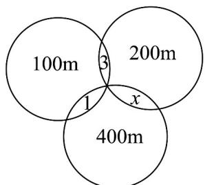

> [!faq]- 《专题01 集合高频题型精准突破（八大题型）（高效培优期末专项训练）》官方解析
>
> > [!success]- **【答案】** 15 27
>
> > [!note]- **【分析】**
> > 第一天售出商品数减去前两天都售出的商品数即可解决第一空，再求出第三天售出的商品中有多少种商品第二天未售出，要使商品种数最少，则只需第三天中这12种第二天未售出的商品恰都是第一天售出过，即可得解·
>
> > [!note]- **【解析】**
> > 因为前两天都售出的商品有3种，
> >
> > 因此第一天售出且第二天没有售出的商品有18-3=15种；
> >
> > 同理由后两天都售出的商品有 4 种，
> >
> > 则第三天售出的商品中有 $16 - 4 = 12$ 种第二天未售出；
> >
> > 所以三天售出商品种数最少时，
> >
> > 即第三天中这 $12(12 < 15)$ 种第二天未售出的商品恰都是第一天售出过的，且第二天未售出的那些即可，所以这三天售出的商品至少有 $15 + 12 = 27$ 种·
> >
> > 故答案为：15；27.
> >
> > 56. 振华学校举办秋季运动会时，某高一班级共有 $^{18}$ 名同学参加比赛，有 $^{7}$ 人参加 $^{100m}$ 比赛，有 $^{6}$ 人参加 $^{200m}$ 比赛，有 $^{10}$ 人参加 $^{400m}$ 比赛，同时参加 $^{100m}$ 比赛和 $^{200m}$ 比赛的有 $^{3}$ 人，同时参加 $^{100m}$ 比赛和 $^{400m}$ 比赛的有 $^{1}$ 人，没有人同时参加三项比赛，则同时参加 $^{200m}$ 比赛和 $^{400m}$ 比赛的有\_\_\_\_人。
> >
> > 【答案】1
> >
> > 【分析】设同时参加 $200\mathrm{m}$ 比赛和 $400\mathrm{m}$ 比赛的有 $x$ 人，由题意作出韦恩图，根据题意得出关于 $x$ 的等式即可求解。
> >
> > 【详解】设同时参加 $200 \, m$ 比赛和 $400 \, m$ 比赛的有 x 人，
> >
> > 由题意作出韦恩图如图所示：
> >
> > 
> >
> > 由图可得 $7 + 6 + 10 - 3 - 1 - x = 18$ ，解得 $x = 1$
> >
> > 故同时参加 $200m$ 比赛和 $400m$ 比赛的有 1 人.
> >
> > 故答案为：1.
> >
> > 考点 08 集合新定义
