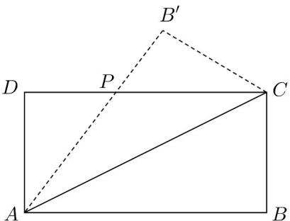

> [!faq]- 《专题04 一元二次不等式高频题型精准突破（八大题型）（高效培优期末专项训练）》官方解析
>
> > [!success]- **【答案】** 
>
> > [!note]- **【分析】**
> > 由题设可得 $AD + DP + PC = x + y + \sqrt{x^{2} + y^{2}} = 6 + 3\sqrt{2}$ ，结合基本不等式得到关于 $\sqrt{xy}$ 的一元二次不等式并求解集，结合 $\triangle ADP$ 的面积 $S = \frac{xy}{2}$ 即可得最大值，注意成立条件。
>
> > [!note]- **【解析】**
> > 由题意 $\triangle ADP\cong \triangle CB'P$ ，而 $AD = x$ ， $DP = y$
> >
> > 所以 $PC = \sqrt{x^2 + y^2}$ ，而矩形 $ABCD(AB > BC)$ 的周长为 $12 + 6\sqrt{2}$
> >
> > 则 $AD + DP + PC = x + y + \sqrt{x^{2} + y^{2}} = 6 + 3\sqrt{2}$ ，整理得
> >
> > $xy = (27 + 18\sqrt{2}) - (6 + 3\sqrt{2})\sqrt{x^2 + y^2} \leq (27 + 18\sqrt{2}) - (6 + 6\sqrt{2})\sqrt{xy}$ ，仅当 x = y 等号成立，
> >
> > 所以 $(\sqrt{xy})^2 + (6 + 6\sqrt{2})\sqrt{xy} - (27 + 18\sqrt{2}) \leq 0$ ，而 $\sqrt{xy} > 0$ ，可得 $0 < \sqrt{xy} \leq 3$
> >
> > 则 $0 < xy \leq 9$ ，而 $\triangle ADP$ 的面积 $S = \frac{xy}{2}$ ，故最大值为 $\frac{9}{2}$ ，此时 $x = y = 3$ .
> >
> > 故答案为： $\frac{9}{2}$
