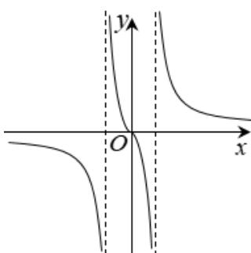

> [!faq]- 《专题05 函数的定义域及值域高频题型精准突破（八大题型）（高效培优期末专项训练）》官方解析
>
> > [!success]- **【答案】** A
>
> > [!note]- **【分析】**
> > 根据函数定义域排除 $^{B}$ ，取特殊值排除 $^{C}$ ，根据函数的奇偶性排除 $^{D}$ ，得到答案。
>
> > [!note]- **【解析】**
> > $f(x)=\frac{2x}{x^{2}+1}$ 函数的定义域为 $^{R}$ ，不符合函数图像，排除 $^{B}$ ；
> > 当 x>1 时， $f(x)=\frac{2x}{1-|x|}<0$ ，不符合函数图像，排除 $^{C}$ ； $f(x)=\frac{x^{2}+1}{x^{2}-1}=f(-x)$ ，故函数为偶函数，不符合函数图像，排除D.
> >
> > 故选：A.
> >
> > 56. 我国著名数学家华罗庚曾说：“数缺形时少直观，形少数时难入微，数形结合白般好，隔离分家万事休”在数学的学习和研究中，有时可凭借函数的图象分析函数解析式的特征·已知函数 $f(x)$ 的部分图象如图所示，则函数 $f(x)$ 的解析式可能为（）
> >
> > 【答案】
> >
> > 
> >
> > $$
> > f (x) = \frac {2 x}{1 - | x |}
> > $$
> >
> > $$
> > f (x) = \frac {2 x}{x ^ {2} + 1}
> > $$
> >
> > $$
> > f (x) = \frac {2 x}{x ^ {2} - 1}
> > $$
> >
> > $$
> > f (x) = \frac {x ^ {2} + 1}{x ^ {2} - 1}
> > $$
> >
> > 【答案】C
> >
> > 【分析】根据图象函数为奇函数，排除 $^{D}$ ；再根据函数定义域排除 $^{B}$ ；再根据x>1时函数值为正排除 $^{A}$ ；
> > 即可得出结果
> > 【详解】由题干中函数图象可知其对应的函数为奇函数，
> > 而 $^{D}$ 中的函数为偶函数，故排除 $^{D}$ ;
> > 由题干中函数图象可知函数的定义域不是实数集，故排除 $^{B}$ ;
> > 对于 $^{A}$ ，当x>1时，y<0，不满足图象；对于 $^{C}$ ，当x>1时，y>0，满足图象。
> > 故排除 $^{A}$ ，选 $^{C}$ .
> > 故选： $^{C}$
> >
> > 考点 08 实际问题研究函数图像
