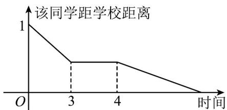
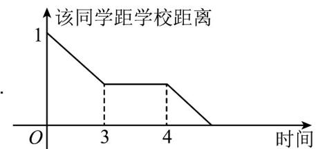
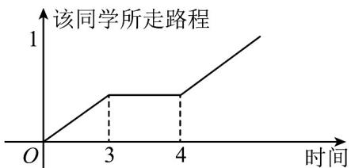
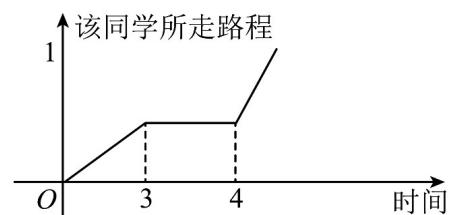
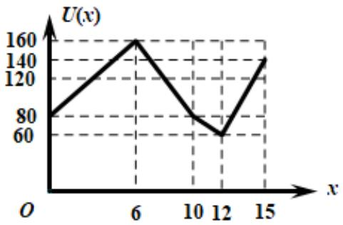
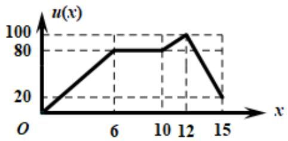
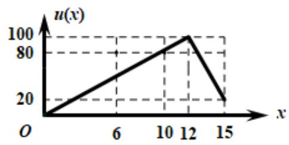
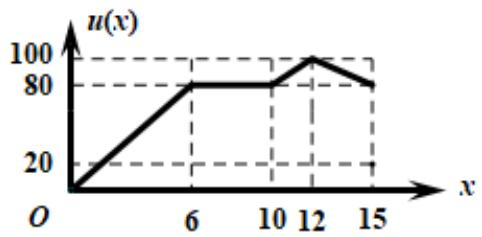
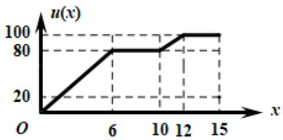

> [!faq]- 《专题05 函数的定义域及值域高频题型精准突破（八大题型）（高效培优期末专项训练）》官方解析
>
> > [!success]- **【答案】** A  B  C  D 
>
> > [!note]- **【分析】**
> > 结合题意分析即可求解·
>
> > [!note]- **【解析】**
> > 该同学从居住地出发，一开始距离学校距离为 1km，排除 C、D，
> >
> > 先跑步 $^{3}$ 分钟，再买早餐耽搁 $^{1}$ 分钟，最后步行，速度比跑步要慢一些，所以相对而言， $^{A}$ 选项更合适·
> >
> > 故选：A.
> >
> > 62. 为庆祝深圳特区成立 $^{40}$ 周年， $^{2020}$ 年 $^{10}$ 月 $^{11}$ 日深圳无人机精英赛总决赛在光明区举行，全市共 $^{39}$ 支队伍参加，下图反映了某学校代表队制作的无人机载重飞行从某时刻开始 $^{15}$ 分钟内的速度 $U(x)$ （单位：米/分）与时间 $x(\text{单位：分})$ 的关系·若定义“速度差函数” $u(x)$ 为无人机在时间段为 $[0, x]$ 内的最大速度与最小速度的差，则 $u(x)$ 的图象为（）
> >
> > 【答案】
> >
> > 
> >
> > A
> > 
> >
> > B
> > 
> >
> > C
> > 
> > D
> >
> > 
> >
> > 【答案】D
> >
> > 【分析】根据，“速度差函数” $u(x)$ 的定义，分 $x \in [0, 6]$ 、 $x \in [6, 10]$ 、 $x \in [10, 12]$ 、 $x \in [12, 15]$ 四种情况，分别求得函数的解析式，从而得到函数的图象。
> >
> > 【详解】解：由题意可得，当 $x \in [0, 6]$ 时，翼人做匀加速运动， $v(x) = 80 + \frac{40}{3} x$ 。“速度差函数” $u(x) = \frac{40}{3} x$ 。当 $x \in [6, 10]$ 时，翼人做匀减速运动，速度 $v(x)$ 从 $^{160}$ 开始下降，一直降到 $^{80}$ ， $u(x) = 160 - 80 = 80$ 。
> >
> > 当 $x \in [10, 12]$ 时，翼人做匀减速运动， $v(x)$ 从80开始下降， $v(x) = 180 - 10x$
> >
> > $$
> > u (x) = 1 6 0 - (1 8 0 - 1 0 x) = 1 0 x - 2 0
> > $$
> >
> > 当 $x \in [12, 15]$ 时，翼人做匀加速运动，“速度差函数” $u(x) = 160 - 60 = 100$
> >
> > 结合所给的图象，
> >
> > 故选 **D**.
