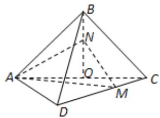
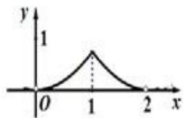
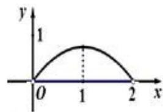
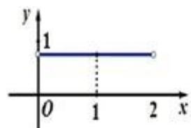
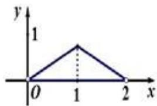
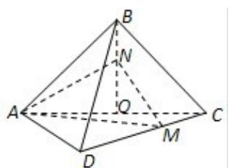

> [!faq]- 《专题05 函数的定义域及值域高频题型精准突破（八大题型）（高效培优期末专项训练）》官方解析
>
> > [!success]- **【答案】**  A  B  C  D 
>
> > [!note]- **【分析】**
> > 先根据条件得到 $BO_{\perp}$ 平面 ACD；进而求出三棱锥 NAMC 的体积的表达式，即可求出结论。
>
> > [!note]- **【解析】**
> > 
> >
> > 因为 $ABCD$ 是正方形，所以 $AB = BC$ 。而 $O$ 是 $AC$ 中点，所以 $BO \perp AC$ 。因为面 $ABC \perp$ 面 $ACD$ ，所以 $BO \perp$ 面 $ACD$ ，从而可得 $NO \perp$ 面 $ACD$ 。因为正方形 $ABCD$ 的边长为 $2\sqrt{2}$ ， $CM = BN = x$ ，所以
> >
> > $S_{\Delta ACM} = \frac{CM}{CD}\cdot S_{\Delta ACD} = \frac{x}{2\sqrt{2}}\cdot \frac{1}{2}\cdot (2\sqrt{2})^2 = \sqrt{2} x$ .因为 $BN = x,OB = 2$ ，所以 $ON = 2 - x$ ，从而 $f(x) = V_{N - AMC} = \frac{1}{3}\cdot ON\cdot S_{\Delta ACM} = \frac{1}{3} (2 - x)\sqrt{2} x = \frac{\sqrt{2}}{3} (-x^2 +2x)$ ，则其函数图象为B
