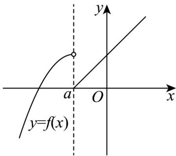

> [!faq]- 《专题06 函数基本性质高频题型精准突破（八大题型）（高效培优期末专项训练）》官方解析
>
> > [!success]- **【答案】** B
>
> > [!note]- **【分析】**
> > 利用分段函数的值域是各段值域的并集，结合二次函数的单调性列不等式求解即可·
>
> > [!note]- **【解析】**
> > 当 $a = 0$ 时，
> >
> > 若 $x < a$ ，则 $f(x) = a(x - a)^2 + 1 > 1$
> >
> > 若 $x \quad a$ ，则 $f(x) = |x - 2a| - 1 - 1$
> >
> > 函数 $f(x)$ 的值域不可能为 R；
> >
> > 当 $a < 0$ 时， $2a < a$
> >
> > $f(x) = a(x - a)^{2} + 1$ 在 $(- \infty, a)$ 上单调递增，
> >
> > $f(x)=|x-2a|-1$ 在 $(a,+\infty)$ 上单调递增，
> >
> > 若函数 $f(x)$ 的值域为 $\mathbf{R}$ ，则 $\left|a\right| - 1 \leq 1$ ，解得 $-2 \leq a < 0$ ；
> >
> > 
> >
> > 综上所述，实数 a 的取值范围是 $\left[-2,0\right)$ .
> >
> > 故选 **B**.
