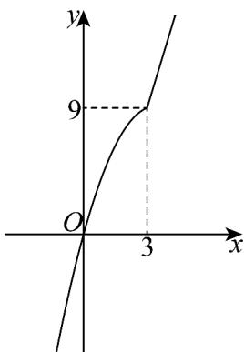

> [!faq]- 《专题06 函数基本性质高频题型精准突破（八大题型）（高效培优期末专项训练）》官方解析
>
> > [!success]- **【答案】** 15 (1,4)
>
> > [!note]- **【分析】**
> > 根据函数的解析式求得 $f(1)$ 的值，即可求得 $f(f(1))$ ；判断 $f(x)=\left\{\begin{aligned}&3x,x&3\\ &-x^{2}+6x,x<3\end{aligned}\right.$ 的单调性，从而将 $f(x^{2}-2x)<f(3x-4)$ 转化为 $x^{2}-2x<3x-4$ ，解不等式即可得答案。
>
> > [!note]- **【解析】**
> > 由题意可得 $f(1) = -1^2 + 6 = 5$ ，所以 $f(f(1)) = f(5) = 3 \times 5 = 15$
> >
> > 当 $x = 3$ 时， $f(x) = 3x$ 在 $[3, +\infty)$ 上单调递增，且 $f(x) = 9$ ；
> >
> > 当 $x < 3$ 时， $f(x) = -x^2 + 6x$ 在 $(- \infty, 3)$ 上单调递增，且 $f(x) < 9$
> >
> > 
> >
> > 故 $f(x)=\left\{\begin{aligned}&3x,x&3\\ &-x^{2}+6x,x<3\end{aligned}\right.$ 在 $^{R}$ 上单调递增，
> >
> > 故由 $f\left(x^{2} - 2x\right) <   f\left(3x - 4\right)$ 可得 $x^{2} - 2x <   3x - 4$ ，即 $x^{2} - 5x + 4 <   0$
> >
> > 解得 $1 < x < 4$ ，即 $f\left(x^{2} - 2x\right) < f(3x - 4)$ 的解集是 $(1,4)$
> >
> > 故答案为：15，(1,4)
