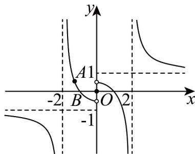

> [!faq]- 《专题06 函数基本性质高频题型精准突破（八大题型）（高效培优期末专项训练）》官方解析
>
> > [!success]- **【答案】** $-\frac{7}{3} / -2\frac{1}{3}$
>
> > [!note]- **【分析】**
> > 根据奇函数先得到 $f(x) = \begin{cases} \frac{x - 1}{x - 2}, & x > 0 \\ 0, & x = 0 \\ -\frac{x + 1}{x + 2}, & x < 0 \end{cases}$ ，做出函数的图象，根据图象可得 $t = -\frac{4}{3}$ ， $a = -1$ ，进
> >
> > 而可得·
>
> > [!note]- **【解析】**
> > 解：由已知可得当 $x < 0$ 时， $-x > 0$ ，则 $f(x) = -f(-x) = -\frac{x + 1}{x + 2}$ ，
> >
> > 所以 $f(x)=\left\{\begin{aligned}&\frac{x-1}{x-2},&x>0\\ &0,x=0\\&-\frac{x+1}{x+2},&x<0\end{aligned}\right.$
> >
> > 令 $f(x)=0$ ，则 $x=-1,0,1$ ；令 $f(x)=\frac{1}{2}$ ，则 $x=-\frac{4}{3}$ .
> >
> > 作出函数 $f(x)$ 的图象，
> >
> > 
> >
> > 若 $x \in [t, a]$ ， $f(x)$ 的值域是 $\left[0, \frac{1}{2}\right]$ ，可得 $t = -\frac{4}{3}$ ， $a = -1$ ，所以 $t + a = -\frac{7}{3}$ .
> >
> > 故答案为： $-\frac{7}{3}$
