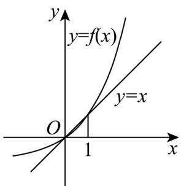

> [!faq]- 《专题07 指数与指数函数高频题型精准突破（八大题型）（高效培优期末专项训练）》官方解析
>
> > [!success]- **【答案】** (1) $a = 1, b = -1(2) - 1(3)(0,1)$
>
> > [!note]- **【分析】**
> > （1）待定系数解方程组即可求解·
> >
> > (2) 由 $f(x) = 2^x - 1 > -1$ 即可得解.
> >
> > (3) 在同一平面直角坐标系中画出函数 $y = f(x)$ 的图象和 $y = x$ 的图象，观察即可得解.
>
> > [!note]- **【解析】**
> > （1）由题意 $f(0)=a+b=0, f(1)=2a+b=1$ ，解得a=1,b=-1。
> >
> > (2) 由 (1) 可知 $f(x) = 2^x - 1 > -1$ ，若 $\forall x \in \mathbf{R}, f(x) > m$ ，则 $m \leq -1$ ，
> >
> > 所以 $m$ 的最大值为 $-1\cdot$
> >
> > (3) 由题意不等式 $g(x) < 0$ 等价于 $f(x) < x$ ，且注意到 $f(0) = 0, f(1) = 1$
> >
> > 在同一平面直角坐标系中画出函数 $y = f(x)$ 的图象和 $y = x$ 的图象如图所示：
> >
> > 
> >
> > 由图可知：不等式 $g(x) < 0$ 的解集为 $(0,1)$ .
