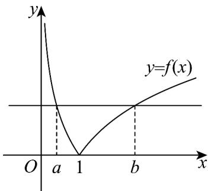

> [!faq]- 《专题08 对数与对数函数高频题型精准突破（八大题型）（高效培优期末专项训练）》官方解析
>
> > [!success]- **【答案】** 8
>
> > [!note]- **【分析】**
> > 根据对数型函数的图象，结合函数的单调性进行求解即可·
>
> > [!note]- **【解析】**
> > 函数 $f(x) = |\log_2 x| = \begin{cases} \log_2 x, & x = 1 \\ -\log_2 x, & 0 < x < 1 \end{cases}$ 的图象如下图所示：
> >
> > 当 $0 < a < b$ 时， $f(a) = f(b)$ ，因此有 $0 < a < 1 < b$
> >
> > 由 $f(a) = f(b) \Rightarrow -\log_2 a = \log_2 b \Rightarrow \log_2 a + \log_2 b = 0 \Rightarrow \log_2 ab = 0 \Rightarrow ab = 1$
> >
> > 于是当 $x \in [a^2, b]$ ，即当 $x \in \left[a^2, \frac{1}{a}\right]$ 时，因为 $0 < a < 1$ ，
> >
> > 所以 $0 < a^2 < 1 < \frac{1}{a}$ ，由函数图象可知 $f(x)_{\min} = f(1) = 0$ ，
> >
> > $$
> > f \left(a ^ {2}\right) = - \log_ {2} a ^ {2} = - 2 \log_ {2} a, f \left(\frac {1}{a}\right) = \log_ {2} \frac {1}{a} = - \log_ {2} a
> > $$
> >
> > 因为 $f\left(a^{2}\right)-f\left(\frac{1}{a}\right)=-\log_{2}a>0$
> >
> > 所以 $f\left(a^{2}\right) > f\left(\frac{1}{a}\right)$ ，所以 $f(x)_{\max} = f\left(a^{2}\right) = -2\log_2a$
> >
> > 因为函数 $f(x)$ 在 $\left[a^{2},b\right]$ 上的最大值与最小值之差为 2，
> >
> > 所以 $-2\log_{2}a - 0 = 2\Rightarrow a = \frac{1}{2}\Rightarrow b = 2$
> >
> > 因此 $\frac{b^{2}}{a}=\frac{4}{\frac{1}{2}}=8$ ，
> >
> > 故答案为：8
> >
> > 
>
> > [!tip]- **【名师点睛】**
> > 关键点点睛：本题的关键是利用数形结合思想得到 $0 < a < 1 < b$ ，再根据函数的单调性进行求解。46．已知函数 $f(2x - 1) = \frac{5 - 2x}{3 + 2x}$ .
> >
> > (1)求 $f(x)$ 的解析式；
> >
> > (2) 判断 $f(x)$ 在 $(-4, +\infty)$ 上的单调性并根据定义加以证明；
> >
> > (3)若函数 $g(x) = \log_a f(x)$ 在 $[-1, 2]$ 上的最小值是-1，求 $a$ 的值.
> >
> > 【答案】(1) $f(x)=\frac{4-x}{4+x}$
> >
> > (2) $f(x)$ 在 $(-4,+\infty)$ 上单调递减，证明见解析
> >
> > (3) $a=\frac{3}{5}$ 或a=3.
> >
> > 【分析】（1）利用换元法可求函数 $f(x)$ 的解析式；
> >
> > (2) 利用单调性的定义可证 $f(x)$ 在 $(-4, +\infty)$ 上单调递减；
> >
> > (3) 分 0 < a < 1, a > 1 两种情况求得 $g(x)$ 的最小值，再结合已知求得 a 的值.
> >
> > 【详解】（1）设 $t=2x-1$ ，得 $x=\frac{t+1}{2}$ ，
> >
> > 则 $f(t) = \frac{5 - 2 \times \frac{t + 1}{2}}{3 + 2 \times \frac{t + 1}{2}} = \frac{4 - t}{4 + t}$ ，
> >
> > 故 $f(x)=\frac{4-x}{4+x}$ .
> >
> > (2) $f(x)$ 在 $(-4, +\infty)$ 上单调递减.
> >
> > 证明如下：
> >
> > 任取 $x_{1}, x_{2} \in (-4, +\infty)$ ，且 $x_{1} < x_{2}$
> >
> > $$
> > f \left(x _ {1}\right) - f \left(x _ {2}\right) = \frac {4 - x _ {1}}{4 + x _ {1}} - \frac {4 - x _ {2}}{4 + x _ {2}} = \frac {\left(4 - x _ {1}\right) \left(4 + x _ {2}\right) - \left(4 - x _ {2}\right) \left(4 + x _ {1}\right)}{\left(4 + x _ {1}\right) \left(4 + x _ {2}\right)}
> > $$
> >
> > $= \frac{8(x_2 - x_1)}{(4 + x_1)(4 + x_2)}$
> >
> > 因为 $x_{1}, x_{2} \in (-4, +\infty)$ ，且 $x_{1} < x_{2}$ ，所以 $4 + x_{1} > 0$ ， $4 + x_{2} > 0$ ， $x_{2} - x_{1} > 0$
> >
> > 所以 $\frac{8(x_2 - x_1)}{(4 + x_1)(4 + x_2)} > 0$ ，所以 $f(x_1) > f(x_2)$ ，
> >
> > 则 $f(x)$ 在 $(-4, +\infty)$ 上单调递减·
> >
> > (3) 当 0 < a < 1 时， $y = \log_{a} x$ 是 $(0, +\infty)$ 上的减函数，
> >
> > 由（2）可知函数 $f(x)$ 是 $[-1, 2]$ 上的减函数，
> >
> > 所以 $g(x)$ 是 $[-1, 2]$ 上的增函数，
> >
> > 所以 $g(x)_{\min}=g(-1)=\log_{a}\frac{5}{3}=-1$ ，解得 $a=\frac{3}{5}$ .
> >
> > 当 $a > 1$ 时， $y = \log_a x$ 是 $(0, +\infty)$ 上的增函数，
> >
> > 由（2）可知函数 $f(x)$ 是 $[-1, 2]$ 上的减函数，
> >
> > 则 $g(x)$ 是 $[-1, 2]$ 上的减函数，
> >
> > 所以 $g(x)_{\min}=g(2)=\log_{a}\frac{1}{3}=-1$ ，解得 a=3。
> >
> > 综上， $a = \frac{3}{5}$ 或 $a = 3$
