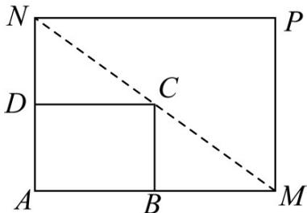

<!-- question-source:start -->
52. 如图所示，将一个矩形花坛 $ABCD$ 扩建成一个更大的矩形花坛 $AMPN$ ，要求 $M$ 在射线 $AB$ 上， $N$ 在射线 $AD$ 上，且对角线 $MN$ 过 $C$ 点。已知 $AB = 4$ 米， $AD = 3$ 米，设 $AN$ 的长为 $x(x > 3)$ 米。

(1)要使矩形 $AMPN$ 的面积大于 $^{54}$ 平方米，则 $AN$ 的长应在什么范围内？

(2)求当 AM, AN 的长度分别是多少时，矩形花坛 AMPN 的面积最小，并求出此最小值；
<!-- question-source:end -->

![[高中/课堂同步/题库/人教A版高中数学同步讲义(2026)/01_必修第一册/期末/专题09 幂函数与函数应用高频题型精准突破（八大题型）（高效培优期末专项训练）/考点07_分式型函数模型的应用/questions/answers/Q00073887A1.md]]
