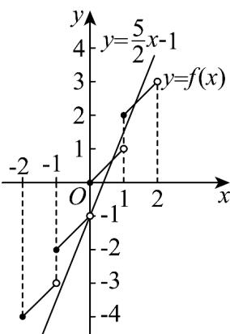

> [!faq]- 《专题10 二分法与函数零点方程高频题型精准突破（八大题型）（高效培优期末专项训练）》官方解析
>
> > [!success]- **【答案】** A
>
> > [!note]- **【分析】**
> > 根据题意，分别求得 $x \in [1,2)$ ， $x \in [0,1)$ ， $x \in [-1,0)$ 和 $x \in [-2,-1)$ ，方程的解，进而得到答案。【详解】当 $x \in [1,2)$ 时， $[x] = 1$ ，此时 $f(x) = x + 1$ ，令 $x + 1 = \frac{5x}{2} - 1$ ，解得 $x = \frac{4}{3} \in [1,2)$ ；当 $x \in [0,1)$ 时， $[x] = 0$ ，此时 $f(x) = x$ ，令 $x = \frac{5x}{2} - 1$ ，解得 $x = \frac{2}{3} \in [0,1)$ ；当 $x \in [-1,0)$ 时， $[x] = -1$ ，此时 $f(x) = x - 1$ ，令 $x - 1 = \frac{5x}{2} - 1$ ，解得 $x = 0 \notin [-1,0)$ ；当 $x \in [-2,-1)$ 时， $[x] = -2$ ，此时 $f(x) = x - 2$ ，令 $x - 2 = \frac{5x}{2} - 1$ ，解得 $x = -\frac{2}{3} \notin [-2,-1)$ ，……如图所示，所以方程 $f(x) = \frac{5x}{2} - 1 (x < 2)$ 只有两个根，分别为 $\frac{4}{3}$ 和 $\frac{2}{3}$ ，所以两根之和为 2。故选：A.
> >
> > 
> >
> > 3. 函数 $f(x) = \ln x - 1$ 的零点是 \_\_\_\_.
> >
> > 【答案】e
> >
> > 【分析】根据函数零点的定义求解即可·
>
> > [!note]- **【解析】**
> > 令 $f(x) = \ln x - 1 = 0$ ，解得 $x = e$ ，所以函数 $f(x) = \ln x - 1$ 的零点是 $e$ .
> >
> > 故答案为：e·
