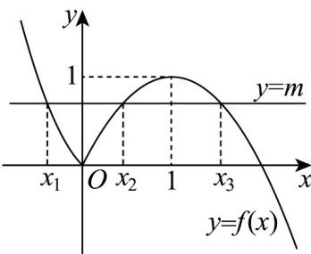

> [!faq]- 《专题10 二分法与函数零点方程高频题型精准突破（八大题型）（高效培优期末专项训练）》官方解析
>
> > [!success]- **【答案】** A. $m$ 的取值范围是(0,1] B. $x_2 + x_3 = 2$ C. $x_1 + x_2 + x_3$ 的取值范围为 $(\frac{3}{2}, 2)$ D. $x_1x_2 + x_1x_3 + x_2x_3$ 的取值范围是 $[-\frac{1}{8}, 0)$
>
> > [!note]- **【分析】**
> > 分析函数 $f(x)$ 的性质，将方程零点问题转化为函数 $y = f(x)$ 的图象与直线 $y = m$ 的交点问题，再作出函数图象，利用图象，结合二次函数性质逐项求解判断·
>
> > [!note]- **【解析】**
> > 函数 $f(x) = \begin{cases} 2x^2 - x, & x \leq 0 \\ -x^2 + 2x, & x > 0 \end{cases}$ 在 $(- \infty, 0]$ 上单调递减，函数值集合为 $[0, +\infty)$ ；
> >
> > 在 $(0,1]$ 上单调递增，函数值集合为 $(0,1]$ ；在 $[1, +\infty)$ 上单调递减，函数值集合为 $(- \infty, 1]$ ，方程 $f(x) = m$ 恰有3个不同的实数根 $x_{1}, x_{2}, x_{3}$ ，即函数 $y = f(x)$ 的图象与直线 $y = m$ 有3个交点，在同一坐标系内作出函数 $y = f(x)$ 的图象与直线 $y = m$ ，如图：
> >
> > 
> >
> > 对于 A，m 的取值范围是 $(0,1)$ ，A 错误；
> >
> > 对于 B， $x_{2}, x_{3}$ 为方程 $-x^{2} + 2x = m$ ，即 $x^{2} - 2x + m = 0$ 的两个根， $x_{2} + x_{3} = 2$ ，B 正确；
> >
> > 对于 $\mathbb{C}$ ，由 $2x_{1}^{2} - x_{1} = m,0 <   m <   1$ ，得 $0 <   2x_1^2 -x_1 <   1$ ，又 $x_{1} <   0$ ，解得 $-\frac{1}{2} <  x_{1} <   0$
> >
> > 因此 $\frac{3}{2} < x_{1} + x_{2} + x_{3} < 2$ ，C正确；
> >
> > 对于 D，由选项 B 知， $x_{2}x_{3}=m=2x_{1}^{2}-x_{1}$ ，则 $x_{1}x_{2}+x_{1}x_{3}+x_{2}x_{3}=x_{1}(x_{2}+x_{3})+x_{2}x_{3}=2x_{1}^{2}+x_{1}$
> >
> > 函数 $y = 2x_{1}^{2} + x_{1}$ 在 $(- \frac{1}{2}, -\frac{1}{4}]$ 上单调递减，在 $[- \frac{1}{4}, 0)$ 上单调递增，
> >
> > 当 $x_{1} = -\frac{1}{4}$ 时， $y_{\min} = -\frac{1}{8}$ ，而 $y < 0$ ，则 $-\frac{1}{8} \leq 2x_{1}^{2} + x_{1} < 0$
> >
> > 因此 $x_{1}x_{2} + x_{1}x_{3} + x_{2}x_{3}$ 的取值范围是 $[- \frac{1}{8}, 0)$ ，D 正确
> >
> > 故选 **BCD**
