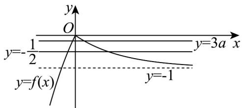

> [!faq]- 《专题10 二分法与函数零点方程高频题型精准突破（八大题型）（高效培优期末专项训练）》官方解析
>
> > [!success]- **【答案】** A. $-\frac{1}{12}$ B. $-\frac{1}{6}$ C. $-\frac{1}{4}$ D. $-\frac{1}{8}$
>
> > [!note]- **【分析】**
> > 将方程的根的问题转化为图象交点问题，由一元二次方程 $2f^{2}(x) + (1 - 6a)\cdot f(x) - 3a = 0$ 解得 $f(x) = 3a$ 或 $f(x) = -\frac{1}{2}$ ，要想有4个交点，则两条直线与 $f(x)$ 图象各有2个交点，根据图象得到 $_a$ 的范围，进而得到 $a$ 可能的取值·
>
> > [!note]- **【解析】**
> > 由 $2f^{2}(x) + (1 - 6a)\cdot f(x) - 3a = 0$ 得 $f(x) = 3a$ 或 $f(x) = -\frac{1}{2}$ 根据二次函数和指数函数图象得到 $f(x)$ 图象，当 $x\to +\infty$ 时， $y\to -1$ 并在同一坐标系中画出 $y = -\frac{1}{2}$ ，与图象有 2 个交点，
> >
> > 要使得关于 $x$ 的方程 $2f^{2}(x) + (1 - 6a)\cdot f(x) - 3a = 0$ 有4个不同的实根，则直线 $y = 3a$ 与图象有2个交点，且两条直线不重合，
> >
> > 根据图象可知 $-1 < 3a < 0$ 且 $3a \neq -\frac{1}{2}$ ，解得 $-\frac{1}{3} < a < 0$ 且 $a \neq -\frac{1}{6}$ ，所以 ACD 符合，
> >
> > 
> >
> > 故选 **ACD**.
