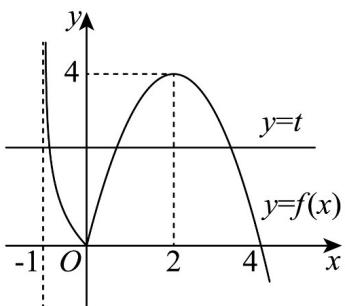

> [!faq]- 《专题10 二分法与函数零点方程高频题型精准突破（八大题型）（高效培优期末专项训练）》官方解析
>
> > [!success]- **【答案】** $\left(2, \frac{17}{4}\right)$
>
> > [!note]- **【分析】**
> > 作出函数 $f(x)$ 的图象，令 $f(x) = t$ ，分析可知关于 $t$ 的方程 $t^2 - at + 1 = 0$ 在 $(0,4)$ 内有两个不同实数根，根据二次方程根的分布可得出关于实数 $a$ 的不等式组，解之即可·
>
> > [!note]- **【解析】**
> > 画出函数 $f(x) = \begin{cases} -x^2 + 4x, & x = 0 \\ -\ln (x + 1), & x < 0 \end{cases}$ 的图象如下图所示，
> >
> > 
> >
> > 令 $f(x) = t$ ，则方程 $f^2(x) - af(x) + 1 = 0$ 可化为 $t^2 - at + 1 = 0$ .
> >
> > 由图可知：当 $t \in (0,4)$ 时， $y = f(x)$ 与 $y = t$ 有3个交点，
> >
> > 关于 x 的方程 $f^{2}(x)-af(x)+1=0(a\in\mathbb{R})$ 有六个相异的实数根，
> >
> > 则方程 在 内有两个不同实数根，所以 $\left\{\begin{aligned}\Delta &= a^{2} - 4 > 0 \\ 0 & < \frac{a}{2} < 4 \\ 0^{2} & -a \times 0 + 1 > 0 \\ 4^{2} & -a \times 4 + 1 > 0\end{aligned}\right.$
> >
> > 解得 $2 < a < \frac{17}{4}$ ，因此，实数 $a$ 的取值范围为 $\left(2, \frac{17}{4}\right)$ .
> >
> > 故答案为： $\left(2,\frac{17}{4}\right)$
