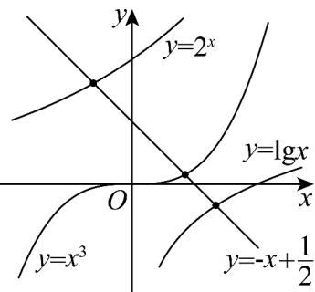

> [!faq]- 《专题10 二分法与函数零点方程高频题型精准突破（八大题型）（高效培优期末专项训练）》官方解析
>
> > [!success]- **【答案】** B
>
> > [!note]- **【分析】**
> > 根据题意分别作出函数 $y = 2^{x}, y = \lg x, y = x^{3}$ 及 $y = -x + \frac{1}{2}$ 的图象，即可求解
>
> > [!note]- **【解析】**
> > 在同一平面直角坐标系中分别作出函数 $y = 2^{x}, y = \lg x, y = x^{3}$ 及 $y = -x + \frac{1}{2}$ 的图象，如图所示.
> >
> > 
> >
> > 由图象可知 b > c > a．故 $^{B}$ 正确
> >
> > 故选 **B**.
