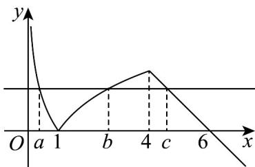

> [!faq]- 《专题10 二分法与函数零点方程高频题型精准突破（八大题型）（高效培优期末专项训练）》官方解析
>
> > [!success]- **【答案】** (4,6)
>
> > [!note]- **【分析】**
> > 画出草图，借助对数性质，得到范围·
>
> > [!note]- **【解析】**
> > 根据题意画出图象，得到 $0 < a < 1, 1 < b < 4, 4 < c < 6$
> >
> > $f(a) = -\log_2a = \log_2a^{-1} = f(b) = \log_2b$ 则 $-\log_2a = \log_2b$
> >
> > 即 $0 = \log_{2} b + \log_{2} a$ ，则 $0 = \log_{2} ab$ ，则 ab = 1，则 abc = c ∈ (4,6).
> >
> > 故答案为： $(4,6)$ .
> >
> > 
> >
> > 考点07 求零点的和
