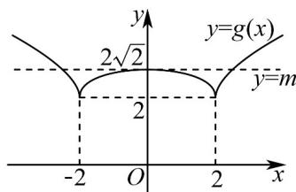

> [!faq]- 《专题10 二分法与函数零点方程高频题型精准突破（八大题型）（高效培优期末专项训练）》官方解析
>
> > [!success]- **【答案】** ABD
>
> > [!note]- **【分析】**
> > 由 $g(x) = f(x + 2) = \sqrt{|x + 2|} +\sqrt{|2 - x|}$ ，应用奇偶性定义判断A；根据 $g(x)$ 与 $f(x)$ 的平移关系，只需研究 $g(x)$ 的单调性、最值及函数图象判断B、C、D的正误即可·
>
> > [!note]- **【解析】**
> > 由题设 $g(x)=f(x+2)=\sqrt{|x+2|}+\sqrt{|2-x|}$ ，定义域为 R，
> >
> > 由 $g(-x) = \sqrt{|-x + 2|} +\sqrt{|2 - (-x)|} = \sqrt{|2 - x|} +\sqrt{|2 + x|} = g(x)$ ，即为偶函数，A对；
> >
> > 由 $[g(x)]^2 = (\sqrt{|x + 2|} +\sqrt{|2 - x|})^2 = |x + 2| + |2 - x| + 2\sqrt{|x^2 - 4|}$
> >
> > 所以 $[g(x)]^2 = \begin{cases} -2x + 2\sqrt{x^2 - 4}, & x \leq -2 \\ 4 + 2\sqrt{4 - x^2}, & -2 < x < 2 \text{且} \\ 2x + 2\sqrt{x^2 - 4}, & x = 2 \end{cases}$ ，则 $g(x) = \begin{cases} \sqrt{-2x + 2\sqrt{x^2 - 4}}, & x \leq -2 \\ \sqrt{4 + 2\sqrt{4 - x^2}}, & -2 < x < 2 \\ \sqrt{2x + 2\sqrt{x^2 - 4}}, & x = 2 \end{cases}$
> >
> > 根据解析式知：在 $(- \infty, -2]$ 上 $g(x)$ 单调递减，在 $(-2,0)$ 上 $g(x)$ 单调递增，在 $(0,2)$ 上 $g(x)$ 单调递减，在 $[2, +\infty)$ 上 $g(x)$ 单调递增，
> >
> > 在区间 $[-2,0]$ 上 $g(x)$ 单调递增，即 $f(x)$ 在区间 $[0,2]$ 上单调递增，B对；
> >
> > 又 $g(-2)=g(2)=2$ ，即 $g(x)$ 2 ，
> >
> > 根据 $g(x)=f(x+2)$ 易知 $f(x)$ 的最小值为 2，C 错；
> >
> > 由 C 分析知， $\left[g(0)\right]^{2}=8\Rightarrow g(0)=2\sqrt{2}$ ，且 x 趋向于正负无穷时 $g(x)$ 趋向于正无穷，
> >
> > 由 $y = f(x) - m$ 有三个不同零点 $x_{1}$ ， $x_{2}$ ， $x_{3}$ ，即 $f(x)$ 与 $y = m$ 有三个交点，
> >
> > 所以 $g(x) = f(x + 2)$ 与 $y = m$ 有三个交点，而 $g(x)$ 的大致图象如下，
> >
> > 
> >
> > 所以 $x_{1}-2+x_{2}-2+x_{3}-2=0$ ，即 $x_{1}+x_{2}+x_{3}=6$ ，D 对.
> >
> > 故选 **ABD**
