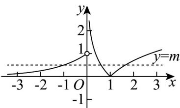

> [!faq]- 《专题10 二分法与函数零点方程高频题型精准突破（八大题型）（高效培优期末专项训练）》官方解析
>
> > [!success]- **【答案】** ACD
>
> > [!note]- **【分析】**
> > 根据函数解析式画出 $f(x)$ 的图象，函数 $g(x)$ 的零点个数，即 $y = f(x)$ 与 $y = m$ 的交点个数，数形结合即可判断 A、B，由图可知 $a < 0 < \frac{1}{e} < b < 1 < c < e$ ，再由对数的运算得到 bc = 1，即可判断 C，由方程 $[f(x)]^{2} - \frac{5}{2} f(x) + 1 = 0$ 得到 $f(x) = \frac{1}{2}$ 或 $f(x) = 2$ ，再数形结合即可判断 D.
>
> > [!note]- **【解析】**
> > 因为 $f(x) = \begin{cases} |\ln x|, & x > 0 \\ 2^x, & x < 0 \end{cases}$ ，则 $f\left(\frac{1}{\mathrm{e}}\right) = f(\mathrm{e}) = 1$ ，
> >
> > 画出 $f(x)$ 的图象如下所示：
> >
> > 
> >
> > 函数 $g(x) = f(x) - m$ 的零点个数，即 $y = f(x)$ 与 $y = m$ 的交点个数，
> >
> > 当 $m = 1$ 时，由图可知 $y = m$ 与 $y = f(x)$ 有2个交点，故函数 $g(x)$ 有2个零点，故A正确；
> >
> > 当 $m = 0$ 时 $y = m$ 与 $y = f(x)$ 有1个交点，即函数 $g(x)$ 有1个零点，故 ${}^{\mathrm{B}}$ 错误；
> >
> > 若函数 $g(x)$ 有 3 个零点 a, b, c (a < b < c)，则 0 < m < 1，
> >
> > 由图可知 $a < 0 < \frac{1}{\mathrm{e}} < b < 1 < c < \mathrm{e}$ ，且 $\left|\ln b\right| = \left|\ln c\right|$ ，即 $-\ln b = \ln c$ ，所以 $\ln (bc) = 0$
> >
> > 则 $bc = 1$
> >
> > 所以 $abc$ 的取值范围为 $\left(-\infty,0\right)$ ，故 $\mathbb{C}$ 正确；
> >
> > 由 $[f(x)]^2 -\frac{5}{2} f(x) + 1 = 0$ ，即 $\left[f(x) - \frac{1}{2}\right]\left[f(x) - 2\right] = 0$
> >
> > 即 $f(x)=\frac{1}{2}$ 或 $f(x)=2$ ，
> >
> > 由图可得 $f(x) = \frac{1}{2}$ 有3个实数根， $f(x) = 2$ 有2个实数根，
> >
> > 所以方程 $[f(x)]^2 -\frac{5}{2} f(x) + 1 = 0$ 有5个根，故D正确.
> >
> > 故选 **ACD**
