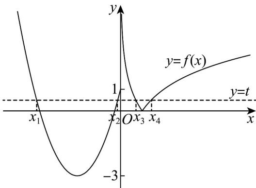

> [!faq]- 《专题10 二分法与函数零点方程高频题型精准突破（八大题型）（高效培优期末专项训练）》官方解析
>
> > [!success]- **【答案】** C
>
> > [!note]- **【分析】**
> > 在同一平面直角坐标系中作出函数 $y = f(x)$ 的图象与 y = t 的图象，结合图象知： $x_{1} + x_{2} = -4$ 且 $\frac{1}{2} \leq x_{3} < 1$ ， $1 < x_{4} \leq 2$ ，再由 $x_{3}x_{4} = 1$ ，利用对勾函数的性质求出 $x_{3} + x_{4}$ 的范围，即可得解。
>
> > [!note]- **【解析】**
> > 因为 $f(x)=\left\{\begin{aligned}&x^{2}+4x+1,x\leq0\\&|\log_{2}x|,x>0\end{aligned}\right.$ ，所以 $f(0)=1$ ，
> > 当 x > 0 时，令 $f(x)=1$ ，即 $|\log_{2}x|=1$ ，解得 $x=\frac{1}{2}$ 或 x=2，
> > 方程 $f(x)=t$ 的解的个数即为 $y=f(x)$ 的图象与 y=t 的图象的交点个数，
> > 在同一平面直角坐标系中作出函数 $y=f(x)$ 的图象与 y=t 的图象，
> >
> > 
> >
> > 结合两函数图象可知，方程 $f(x) = t$ 的四个互不相等的解时， $t$ 的取值范围是 $0 < t \leq 1$ .
> >
> > 不妨设 $x_{1} < x_{2} < x_{3} < x_{4}$
> >
> > 结合图象知： $x_{1}+x_{2}=-4$ 且 $\frac{1}{2}\leq x_{3}<1$ ， $1<x_{4}\leq2$
> >
> > 由 $\left|\log_{2}x_{3}\right|=\left|\log_{2}x_{4}\right|=t$ ，即 $-\log_{2}x_{3}=\log_{2}x_{4}$ ，所以 $x_{3}x_{4}=1$ ，又 $x_{4}\in(1,2]$ ， $\therefore x_{3} + x_{4} = \frac{1}{x_{4}} + x_{4} \in \left(2, \frac{5}{2}\right]$
> >
> > 故 $x_{1}+x_{2}+x_{3}+x_{4}$ 的取值范围是 $\left(-2,-\frac{3}{2}\right]$ .
> >
> > 故选 **C**
