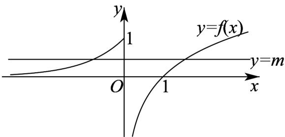

> [!faq]- 《专题10 二分法与函数零点方程高频题型精准突破（八大题型）（高效培优期末专项训练）》官方解析
>
> > [!success]- **【答案】** A. $f(f(1)) = 0$ B. $f(x)$ 的值域为 $[0, +\infty)$ C. $f(x)$ 在 $\mathbf{R}$ 上单调递增 D. 若关于 $x$ 的方程 $f(x) = m$ 有两个不相等的实数根，则 $m$ 的取值范围为 $(0,1]$
>
> > [!note]- **【分析】**
> > 根据函数 $f(x)$ 的解析式计算得出 $f(f(1))$ 的值，可判断A选项；求出函数 $f(x)$ 的值域，可判断B选项；利用特殊值法可判断C选项；数形结合可判断D选项·
>
> > [!note]- **【解析】**
> > 对于A选项， $f(1)=\ln 1=0$ ，故 $f(f(1))=f(0)=\mathrm{e}^{0}=1$ ，A错；
> > 对于B选项，当x>0时， $f(x)=\ln x\in\mathbf{R}$ ；当x≤0时， $f(x)=\mathrm{e}^{x}\in(0,1]$ 。
> > 因此，函数 $f(x)$ 的值域为R，B错；
> > 对于C选项，因为 $f(0)=1$ ， $f(1)=\ln 1=0$ ，则 $f(0)>f(1)$ ，
> > 故函数 $f(x)$ 在R不是增函数，C错；
> > 对于D选项，如下图所示：
> >
> > 
> >
> > 当 $0 < m \leq 1$ 时，直线 $y = m$ 与函数 $f(x)$ 的图象有两个交点，此时关于 $x$ 的方程 $f(x) = m$ 有两个不相等的实数根，故实数 $m$ 的取值范围是 $(0,1]$ ，D对.
> >
> > 故选 **D**.
