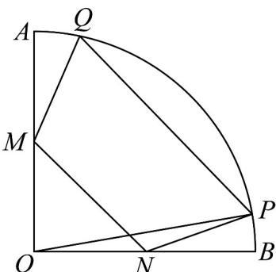

<!-- question-source:start -->
51．如图，在半径为 $^{4}$ 、圆心角为 $90^{\circ}$ 的扇形OAB中；M,N分别为OA,OB的中点，点P,Q在圆弧AB上且MN//PQ.

(1)若 $\angle BOP = 15^{\circ}$ ，求梯形 $MNPQ$ 的高；

(2)求四边形 $MNPQ$ 面积的最大值·
<!-- question-source:end -->

![[高中/课堂同步/题库/人教A版高中数学同步讲义(2026)/01_必修第一册/期末/专题11 任意角与弧度制高频题型精准突破（八大题型）（高效培优期末专项训练）/考点06_扇形面积的计算/questions/answers/Q00074058A1.md]]
