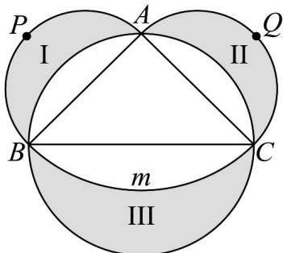

> [!faq]- 《专题11 任意角与弧度制高频题型精准突破（八大题型）（高效培优期末专项训练）》官方解析
>
> > [!success]- **【答案】** $4 - \frac{8}{9}\pi$
>
> > [!note]- **【分析】**
> > 先运用圆与直线相切（得垂直关系）及圆周角定理，得到三角形面积和扇形面积，再用“三角形面积－扇形面积”即可得到阴影面积·
>
> > [!note]- **【解析】**
> > 解：因为 $BC$ 是切线，点 $D$ 是切点，且 $\angle EPF = 40^{\circ}$
> >
> > 所以 $AD \perp BC$ ， $AE = AD = 2$ ， $\angle EAF = 2\angle EPF = 80^{\circ}$
> >
> > 则 $\angle EAF = \frac{80}{180}\pi = \frac{4}{9}\pi$
> >
> > 所以扇形 AEF 的面积为： $\frac{1}{2}\times\frac{4}{9}\pi\times2^{2}=\frac{8}{9}\pi$
> >
> > 又因为 $S_{\Delta ABC} = \frac{1}{2}\times 4\times 2 = 4$
> >
> > 即图中阴影部分的面积是 $4 - \frac{8}{9}\pi$
> >
> > 故答案为： $4 - \frac{8}{9}\pi$
> >
> > 42．月牙定理指以直角三角形两条直角边为直径向外作两个半圆，以斜边为直径向内作半圆，则三个半圆所围成的两个月牙形面积之和等于该直角三角形的面积．该定理“化圆为方”解决了曲、直两个图形可以等面积的问题．如图所示，VABC为大圆的内接等腰直角三角形，大圆的半径为1m，分别以AB，AC为直径作半圆APB，AQC，与大圆分别围成了区域I，II，大圆圆内的弧线是以A为圆心，AC为半径的圆的一部分，与大圆围成了区域III，则三个区域的总面积为\_\_\_\_m²．
> >
> > 
> >
> > 【答案】2
> >
> > 【分析】由题可得 $S_{\triangle ABC} = 1\left(\mathrm{m}^2\right)$ ，由题目信息可得区域I，II的面积之和为1，然后由题目条件算出区域III面积可得答案：
> >
> > 【详解】
> >
> > 
> >
> > 因VABC为大圆的内接等腰直角三角形，大圆的半径为1m，
> >
> > 则 $BC = 2\mathrm{m}$ ，从而 $AB = AC = \frac{\sqrt{2}}{2} BC = \sqrt{2}\mathrm{m}$
> >
> > 则由题意，区域Ⅰ，Ⅱ的面积之和等于 $\triangle ABC$ 的面积： $S_{\triangle ABC} = \frac{1}{2} \times \sqrt{2} \times \sqrt{2} = 1 \left( m^{2} \right)$ ;
> >
> > 而扇形 $ABC$ 的面积为： $\frac{1}{2} \times \frac{\pi}{2} \times (\sqrt{2})^2 = \frac{\pi}{2} (m^2)$
> >
> > 则弓形 $\underset{BmC}{\text{菱}}$ 的面积为： $S_{\triangle ABC} - S_{\text{扇形}ABC} = \left(\frac{\pi}{2} - 1\right)\left(\mathrm{m}^2\right)$ .
> >
> > 从而区域Ⅲ的面积为： $S_{半圆}-S_{弓形BmC}=\frac{1}{2}\pi\times1^{2}-\left(\frac{\pi}{2}-1\right)=1\left(m^{2}\right)$
> >
> > 则三个区域的总面积为 $1 + 1 = 2\left(\mathrm{m}^2\right)$
> >
> > 故答案为：2
