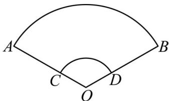

> [!faq]- 《专题11 任意角与弧度制高频题型精准突破（八大题型）（高效培优期末专项训练）》官方解析
>
> > [!success]- **【答案】** 2
>
> > [!note]- **【分析】**
> > 设出圆心角和半径，根据弧长和面积公式得到周长，得到答案
>
> > [!note]- **【解析】**
> > 设扇形的半径为 $r$ ，圆心角为 $\theta$
> >
> > 故扇形的弧长为 $l = \theta r$ ，周长为 $\theta r + 2r = 16$
> >
> > 扇形的面积 $\frac{1}{2}\theta r^2 = 16$ ，解得 $\theta = 2$
> >
> > 故答案为：2
> >
> > 46. 折扇又名“撒扇”、“纸扇”，是一种用竹木或象牙做扇骨、韧纸或绫绢做扇面的能折叠的扇子，如图1.其平面图如图2的扇形AOB，其中 $\angle AOB=135^{\circ},OA=3OC=3$ ，则扇面（曲边四边形ABDC）的面积是
> >
> > 【答案】
> >
> > ( )
> >
> > 
> > 图1
> >
> > 
> > 图2
> >
> > A. $\frac{\pi}{3}$ B. $3\pi$ C. $\frac{8\pi}{3}$ D. $\frac{4\pi}{3}$
> >
> > 【答案】B
> >
> > 【分析】根据大的扇形面积减去小的扇形面积可求得结果·
> >
> > 【详解】 $\angle AOB = 135^{\circ}$ ，转化为弧度制为 $\angle AOB = \frac{3\pi}{4}$
> >
> > 扇形 $AOB$ 的面积为： $\frac{1}{2} \times \frac{3\pi}{4} \times 3^2 = \frac{27\pi}{8}$
> >
> > 扇形 COD 的面积为： $\frac{1}{2}\times\frac{3\pi}{4}\times1^{2}=\frac{3\pi}{8}$ ，
> >
> > 则曲边四边形 $ABDC$ 的面积为： $\frac{27\pi}{8} -\frac{3\pi}{8} = 3\pi .$
> >
> > 故选 **B**.
