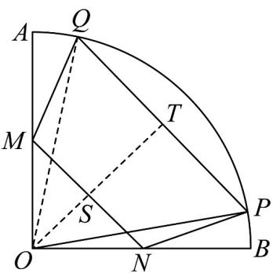

> [!faq]- 《专题11 任意角与弧度制高频题型精准突破（八大题型）（高效培优期末专项训练）》官方解析
>
> > [!success]- **【答案】** (1) $2 \sqrt{3} - \sqrt{2}$ (2)7
>
> > [!note]- **【分析】**
> > （1）作出梯形 $MNPQ$ 的高后结合题意计算即可得；
> >
> > (2) 四边形 MNQP 面积为 $S = S_{\triangle ONP} + S_{\triangle OMQ} + S_{\triangle OPQ} - S_{\triangle OMN}$ ，设 $\angle AOQ = \angle BOP = \theta \in \left(0, \frac{\pi}{4}\right)$ ，结合 OM = ON = 2，即可求出面积关于 $\theta$ 的表达式，即可得最大值.
>
> > [!note]- **【解析】**
> > （1）连接 $OQ$ ，过点 $O$ 作 $OT \perp PQ$ 于点 $T$ ，交 $MN$ 于点 $S$
> >
> > 由 $\angle BOP = 15^{\circ}$ ， $MN / / PQ$ ，扇形半径为 $4$ ， $M,N$ 分别为 $OA,OB$ 的中点，
> >
> > 故 $\angle AOQ = 15^{\circ}$ ， $OP = OQ = 4$ ， $OS\perp MN$ ， $OM = ON = 2$
> >
> > 则 $\angle POQ = 60^{\circ}$ ，故 $\triangle POQ$ 为等边三角形，
> >
> > 则 $OT = \frac{\sqrt{3}}{2} \times 4 = 2\sqrt{3}$ ， $OS = \frac{MN}{2} = \frac{2\sqrt{2}}{2} = \sqrt{2}$ ，
> >
> > 故梯形 MNPQ 的高为 $ST = OT - OS = 2\sqrt{3} - \sqrt{2}$
> >
> > 
> >
> > (2) 设 $\angle AOQ = \angle BOP = \theta \in \left(0, \frac{\pi}{4}\right)$ ，则 $\angle POQ = \frac{\pi}{2} - 2\theta$ ，
> >
> > 且此时 $OM = ON = 2$ ，四边形MNQP面积为：
> >
> > $$
> > S = S _ {\triangle O N P} + S _ {\triangle O M Q} + S _ {\triangle O P Q} - S _ {\triangle O M N}
> > $$
> >
> > $$
> > = \frac {1}{2} \times 2 \times 4 \sin \theta + \frac {1}{2} \times 2 \times 4 \sin \theta + \frac {1}{2} \times 4 \times 4 \sin (\frac {\pi}{2} - 2 \theta) - \frac {1}{2} \times 2 \times 2
> > $$
> >
> > $= -16\sin^2\theta + 8\sin \theta + 6 = -16\left(\sin \theta - \frac{1}{4}\right)^2 + 7$
> >
> > ∴ $\sin\theta=\frac{1}{4}$ 时，S 取最大值 7
