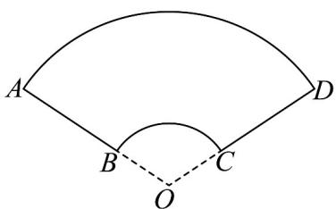

<!-- question-source:start -->
60. 如图所示的几何图形，设弧 $AD$ 的长度是 $l_{1}$ ，弧 $BC$ 的长度是 $l_{2}$ ，扇环 $ABCD$ 的面积为 $S_{1}$ ，扇形 $BOC$ 的面积为 $S_{2} \cdot \text{若} \frac{l_{1}}{l_{2}} = 3$ ，则 $\frac{S_{1}}{S_{2}} = (\quad)$

A.3 B.4 C.6 D.8
<!-- question-source:end -->

![[高中/课堂同步/题库/人教A版高中数学同步讲义(2026)/01_必修第一册/期末/专题11 任意角与弧度制高频题型精准突破（八大题型）（高效培优期末专项训练）/考点08_扇形周长与面积的综合问题/questions/answers/Q00074066A1.md]]
