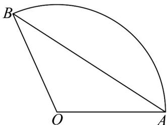

<!-- question-source:start -->
61. 如图，已知扇形的周长为 $^{6}$ ，当该扇形的面积取最大值时，弦长 $AB = (\quad)$

A. $3\sin 1$ B. $3\sin 2$ C. $3\sin 1^{\circ}$ D. $3\sin 2^{\circ}$
<!-- question-source:end -->

![[高中/课堂同步/题库/人教A版高中数学同步讲义(2026)/01_必修第一册/期末/专题11 任意角与弧度制高频题型精准突破（八大题型）（高效培优期末专项训练）/考点08_扇形周长与面积的综合问题/questions/answers/Q00074067A1.md]]
