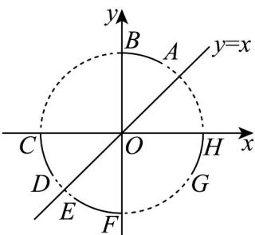

> [!faq]- 《专题12 同角三角函数关系高频题型精准突破（八大题型）（高效培优期末专项训练）》官方解析
>
> > [!success]- **【答案】**  A. AB B. CD C. EF D. GH
>
> > [!note]- **【分析】**
> > 根据三角函数定义解决即可·
>
> > [!note]- **【解析】**
> > 设点 P 的坐标为 $(x,y)$ ，所以由三角函数的定义可得 $\sin\alpha=y,\cos\alpha=x,\tan\alpha=\frac{y}{x}$
> >
> > 因为 $\sin\alpha < \cos\alpha < \tan\alpha$ ，即 $y < x < \frac{y}{x}$ ，
> >
> > 由图知，对于 $^{A}$ ，AB在第一象限，且0<x<y，不满足题意，故 $^{A}$ 错；对于 $^{B}$ ，CD在第三象限，且x<y<0，不满足题意，故 $^{B}$ 错；对于 $^{C}$ ，EF在第三象限，且 $y<x<0<\frac{y}{x}$ ，满足题意，故 $^{C}$ 正确；对于 $^{D}$ ，GH在第四象限，且 $y<0,x>0,\frac{y}{x}<0$ ，不满足题意，故 $^{D}$ 错。
> >
> > 故选 **C**.
