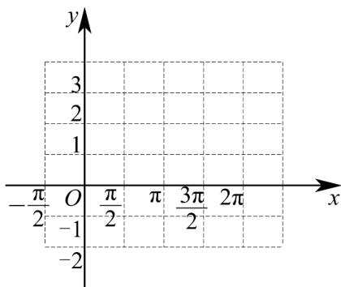

<!-- question-source:start -->
17. 已知函数 $f(x) = 1 - \sin x$

(1)用五点法作图作出 $f(x)$ 在 $x\in[0,2\pi]$ 的图象；

(2)求 $f(x)$ 在 $x\in \left[\frac{\pi}{4},\frac{5\pi}{4}\right]$ 的最大值和最小值.
<!-- question-source:end -->

![[高中/课堂同步/题库/人教A版高中数学同步讲义(2026)/01_必修第一册/期末/专题13 三角函数图像性质与诱导公式高频题型精准突破（八大题型）（高效培优期末专项训练）/考点03_求含sinx型函数的值域和最值/questions/answers/Q00074143A1.md]]
