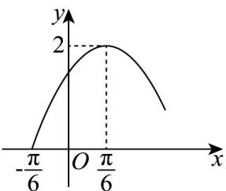

<!-- question-source:start -->
19. 已知函数 $f(x) = A\sin (\omega x + \varphi)\left(A > 0, \omega > 0, 0 < \varphi < \frac{\pi}{2}\right)$ 的部分图象如图所示.

(1)求 $f(x)$ 的解析式；

(2)函数 $f(x)$ 在 $x\in \left[-\frac{\pi}{6},\frac{\pi}{3}\right]$ 上的最大值，并确定此时 $_x$ 的值.
<!-- question-source:end -->

![[高中/课堂同步/题库/人教A版高中数学同步讲义(2026)/01_必修第一册/期末/专题13 三角函数图像性质与诱导公式高频题型精准突破（八大题型）（高效培优期末专项训练）/考点03_求含sinx型函数的值域和最值/questions/answers/Q00074145A1.md]]
