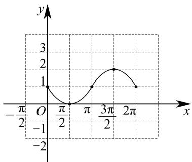

> [!faq]- 《专题13 三角函数图像性质与诱导公式高频题型精准突破（八大题型）（高效培优期末专项训练）》官方解析
>
> > [!success]- **【答案】** (1)作图见解析； (2) $f(x)_{\max} = 1 + \frac{\sqrt{2}}{2}$ , $f(x)_{\min} = 0$ .
>
> > [!note]- **【分析】**
> > （ $^{1}$ ）根据“五点法”作图，即可得函数的图象；
> >
> > (2) 利用函数图象结合 $x \in \left[\frac{\pi}{4}, \frac{5\pi}{4}\right]$ ，即可求得答案.
>
> > [!note]- **【解析】**
> > （1）列表如下：
> >
> > <table><tr><td>x</td><td>0</td><td> $\frac{\pi}{2}$ </td><td> $\pi$ </td><td> $\frac{3\pi}{2}$ </td><td> $2\pi$ </td></tr><tr><td>sinx</td><td>0</td><td>1</td><td>0</td><td>-1</td><td>0</td></tr><tr><td> $1 - \sin x$ </td><td>1</td><td>0</td><td>1</td><td>2</td><td>1</td></tr></table>
> >
> > 对应的图象如图：
> >
> > 
> >
> > (2) 由 $f(x) = 1 - \sin x$ 且 $x \in \left[\frac{\pi}{4}, \frac{5\pi}{4}\right]$ ，结合图象知 $f(x)_{\max} = f\left(\frac{5\pi}{4}\right) = 1 + \frac{\sqrt{2}}{2}$ ，且 $f(x)_{\min} = f\left(\frac{\pi}{2}\right) = 0$ .
