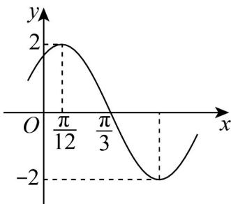

<!-- question-source:start -->
49. 如图，是函数 $f(x) = A\sin (\omega x + \varphi)$ （ $A > 0, \omega > 0, 0 < |\varphi| < \frac{\pi}{2}$ ）图象的一部分

(1)求函数 $f(x)$ 的解析式；

(2)函数 $g(x) = f(x) - 1$ 在区间 $\left[-\frac{\pi}{6}, m\right]$ 上有且仅有两个零点，求实数 $m$ 的取值范围；

(3)若关于 $x$ 的方程 $\frac{f^2(x)}{4} + 2a\sin \left(2x - \frac{\pi}{6}\right) - 2a + 2 = 0$ 在 $\left(0, \frac{\pi}{3}\right)$ 上有解，求实数 $a$ 的取值范围.
<!-- question-source:end -->

![[高中/课堂同步/题库/人教A版高中数学同步讲义(2026)/01_必修第一册/期末/专题13 三角函数图像性质与诱导公式高频题型精准突破（八大题型）（高效培优期末专项训练）/考点07_利用正切型函数单调性求参/questions/answers/Q00074173A1.md]]
