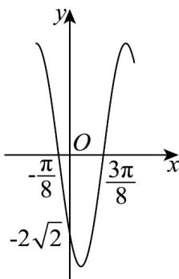

<!-- question-source:start -->
54. 已知函数 $f(x) = A\cos (\omega x + \varphi)(A > 0, \omega > 0, 0 < \varphi < \pi)$ 的部分图象如图所示.

(1)求 $f(x)$ 的解析式；

(2)求 $f(x)$ 在 $\left[\frac{\pi}{2},\pi\right]$ 上的值域；

(3)若 $f(x)$ 在 $[0,m]$ 上恰有3个零点，求 $m$ 的取值范围.
<!-- question-source:end -->

![[高中/课堂同步/题库/人教A版高中数学同步讲义(2026)/01_必修第一册/期末/专题13 三角函数图像性质与诱导公式高频题型精准突破（八大题型）（高效培优期末专项训练）/考点07_利用正切型函数单调性求参/questions/answers/Q00074178A1.md]]
