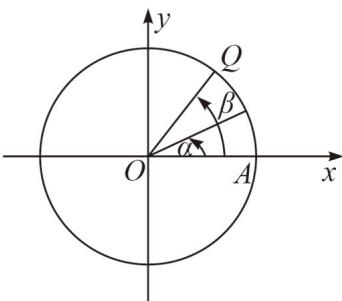

<!-- question-source:start -->
12．如图，在平面直角坐标系中，以原点为圆心，单位长度为半径的圆上有两点 $P(\cos\alpha,\sin\alpha)$ ， $Q(\cos\beta,\sin\beta)$ .

(1) 请分别利用向量 $OP$ 与 $OQ$ 的数量积的定义式和坐标式，证明： $\cos (\alpha - \beta) = \cos \alpha \cos \beta + \sin \alpha \sin \beta$ 。

(2) 已知 (1) 中的公式对任意的 $\alpha$ ， $\beta$ 都成立 (不用证)，请用该公式计算 $\cos 15^\circ$ 的值，并证明：

$$
\sin (\alpha + \beta) = \sin \alpha \cos \beta + \cos \alpha \sin \beta
$$
<!-- question-source:end -->

![[高中/课堂同步/题库/人教A版高中数学同步讲义(2026)/01_必修第一册/期末/专题14 三角恒等变换高频题型精准突破（八大题型）（高效培优期末专项训练）/考点02_求含_15___circ__等特殊角正余/questions/answers/Q00075882A1.md]]
