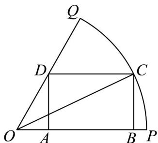

> [!faq]- 《专题14 三角恒等变换高频题型精准突破（八大题型）（高效培优期末专项训练）》官方解析
>
> > [!success]- **【答案】**  A. 当 $\angle POC = \frac{\pi}{6}$ 时，矩形 $ABCD$ 为正方形 B. 当 $\angle POC = \alpha$ 时， $AB = \cos \alpha - \sqrt{3} \sin \alpha$ C. $\triangle OBC$ 面积的最大值为 $\frac{1}{2}$ D. 矩形 $ABCD$ 面积的最大值为 $\frac{\sqrt{3}}{6}$
>
> > [!note]- **【分析】**
> > 结合图形，利用三角函数的定义求出相关边长可判断 A 项；对于 B, C, D 项，通过 $\angle POC = \alpha$ 表示出相关边长，利用二倍角公式，三角恒等变换进行化简，将其化成正弦型函数，利用正弦函数的图象性质即可求出最值.
>
> > [!note]- **【解析】**
> > 对于 A， $\angle POC = \frac{\pi}{6}$ ，OC = 1，则 AD = CB = OC $\sin \angle POC = \frac{1}{2}$ ，OB = OC $\cos \angle POC = \frac{\sqrt{3}}{2}$ ，
> >
> > $OA = \frac{AD}{\tan\frac{\pi}{3}} = \frac{\frac{1}{2}}{\sqrt{3}} = \frac{\sqrt{3}}{6}$ ，则 $AB = OB - OA = \frac{\sqrt{3}}{2} -\frac{\sqrt{3}}{6} = \frac{\sqrt{3}}{3}\neq \frac{1}{2}$ ，故A错误；
> >
> > 对于 B，当 $\angle POC = \alpha$ 时， $BC = \sin \alpha, OB = \cos \alpha$ ， $OA = \frac{AD}{\tan \frac{\pi}{3}} = \frac{\sin \alpha}{\sqrt{3}} = \frac{\sqrt{3}}{3} \sin \alpha$ ， $OB = \cos \alpha$
> >
> > 则 $AB = OB - OA = \cos \alpha -\frac{\sqrt{3}}{3}\sin \alpha$ ，故B错误；
> >
> > 对于 $\mathbb{C}$ ，由 $\mathbb{B}$ 项已得 $BC = \sin \alpha ,OB = \cos \alpha$ ， $S_{\triangle OBC} = \frac{1}{2}\sin \alpha \cdot \cos \alpha = \frac{1}{4}\sin 2\alpha$
> >
> > 因 $0 < \alpha < \frac{\pi}{3}$ ，则 $0 < 2\alpha < \frac{2\pi}{3}$ ，故当 $2\alpha = \frac{\pi}{2}$ ，即 $\alpha = \frac{\pi}{4}$ 时， $S_{\triangle OBC}$ 取得最大值为 $\frac{1}{4}$ ，故 $C$ 错误；
> >
> > 对于 D，由 B 项已得 $AB = \cos \alpha - \frac{\sqrt{3}}{3} \sin \alpha$ ， $BC = \sin \alpha$ ，
> >
> > 则 $S_{ABCD} = (\cos \alpha - \frac{\sqrt{3}}{3} \sin \alpha) \sin \alpha = \frac{1}{2} \sin 2\alpha - \frac{\sqrt{3}}{3} \times \frac{1 - \cos 2\alpha}{2}$
> >
> > $$
> > = \frac {1}{2} \sin 2 \alpha + \frac {\sqrt {3}}{6} \cos 2 \alpha - \frac {\sqrt {3}}{6} = \frac {\sqrt {3}}{3} \sin (2 \alpha + \frac {\pi}{6}) - \frac {\sqrt {3}}{6},
> > $$
> >
> > 因 $0 < \alpha < \frac{\pi}{3}$ ，则 $\frac{\pi}{6} < 2\alpha + \frac{\pi}{6} < \frac{5\pi}{6}$ ，故当 $2\alpha + \frac{\pi}{6} = \frac{\pi}{2}$ ，即 $\alpha = \frac{\pi}{6}$ 时， $S_{ABCD}$ 取得最大值为 $\frac{\sqrt{3}}{6}$ ，故 D 正确。
> >
> > 故选 **D**.
