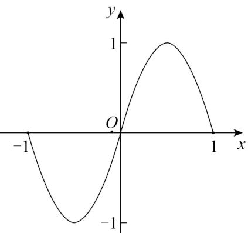
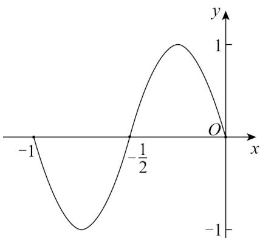

> [!faq]- 《专题15 三角函数图像变换高频题型精准突破（八大题型）（高效培优期末专项训练）》官方解析
>
> > [!success]- **【答案】**   图1 图2 A. $y = f(2x + \frac{1}{2})$ B. $y = f(2x + 1)$ C. $y = f(\frac{x}{2} +\frac{1}{2})$ D. $y = f(\frac{x}{2} +1)$
>
> > [!note]- **【分析】**
> > 利用三角函数的图象变换规律可求得结果·
>
> > [!note]- **【解析】**
> > 观察图象可知，右方图象是由左方图象向左移动一个长度单位后得到 $y = f(x + 1)$ 的图象，再把 $y = f(x - 1)$ 的图象上所有点的横坐标缩小为原来的 $\frac{1}{2}$ （纵坐标不变）得到的，
> > 所以右图的图象所对应的解析式为 $y = f(2x + 1)$ .
> >
> > 故选 **B**
