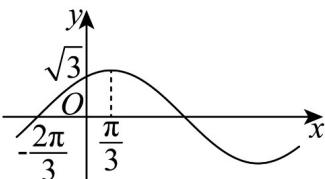

<!-- question-source:start -->
42. 已知函数 $f(x) = A\sin (\omega x + \varphi)\left(A > 0, \omega > 0, |\varphi| < \frac{\pi}{2}\right)$ 的部分图象如图.

(1)求函数 $f(x)$ 的解析式，并写出它的对称中心；

(2)求函数 $f(x)$ 的最小值，并求取最小值时 $x$ 的集合；

(3)若函数 $f(x)$ 的图象向右平移 $m(m > 0)$ 个单位长度得到一偶函数的图象，求 $m$ 的最小值
<!-- question-source:end -->

![[高中/课堂同步/题库/人教A版高中数学同步讲义(2026)/01_必修第一册/期末/专题15 三角函数图像变换高频题型精准突破（八大题型）（高效培优期末专项训练）/考点06_三角函数的奇偶问题/questions/answers/Q00074215A1.md]]
