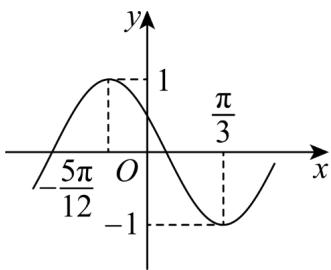

> [!faq]- 《专题15 三角函数图像变换高频题型精准突破（八大题型）（高效培优期末专项训练）》官方解析
>
> > [!success]- **【答案】**  A. $f(x)$ 的最小正周期为 $\pi$ B. $f(x)$ 的图象关于 $\left(\frac{7\pi}{12},0\right)$ 对称 C. $f(x)$ 在 $\left[-\frac{5\pi}{6}, -\frac{\pi}{2}\right]$ 上为减函数 D. 把 $f(x)$ 的图象向右平移 $\frac{5\pi}{12}$ 个单位长度可得一个偶函数的图象
>
> > [!note]- **【分析】**
> > 根据函数图象可得解析式为 $f(x)=\sin(2x+\frac{5\pi}{6})$ ，即可结合选项逐一求解。
>
> > [!note]- **【解析】**
> > 由图可知： $\frac{\pi}{3}-\left(-\frac{5\pi}{12}\right)=\frac{3}{4}T=\frac{3}{4}\frac{2\pi}{|\omega|}\Rightarrow\omega=2,T=\pi$ ，故 A 正确，
> > 当 $x=\frac{\pi}{3}$ 时， $\sin\left(\frac{2\pi}{3}+\varphi\right)=-1\Rightarrow\frac{2\pi}{3}+\varphi=\frac{3\pi}{2}+2k\pi,k\in\mathbb{Z}$ ，进而 $\varphi=\frac{5\pi}{6}+2k\pi,k\in\mathbb{Z}$ ，
> > 由于 $\left|\varphi\right|<\pi,\therefore\varphi=\frac{5\pi}{6}$ ，故 $f(x)=\sin(2x+\frac{5\pi}{6})$ ，
> > 对于 B， $f\left(\frac{7\pi}{12}\right)=\sin(2\times\frac{7\pi}{12}+\frac{5\pi}{6})=\sin2\pi=0$ ，故 B 正确，
> > 对于 C， $x\in\left[-\frac{5\pi}{6},-\frac{\pi}{2}\right],2x+\frac{5\pi}{6}\in\left[-\frac{5\pi}{6},-\frac{\pi}{6}\right]$ ，故 $f(x)$ 在 $\left[-\frac{5\pi}{6},-\frac{\pi}{2}\right]$ 先减后增，故 C 错误，
> > 对于 D，把 $f(x)$ 的图象向右平移 $\frac{5\pi}{12}$ 个单位长度得 $f\left(x-\frac{5\pi}{12}\right)=\sin2x$ ，由于 $y=\sin2x$ 为奇函数，故 D 错误，
> > 故选：AB
> >
> > 45. 将函数 $y=\sin(2x+\varphi)$ 的图象沿轴向左平移 $\frac{\pi}{8}$ 个单位后，得到一个偶函数的图象，则 $\varphi$ 的一个可能取值为（）
> >
> > 【答案】
> > A. $\frac{3\pi}{4}$ B. $\frac{\pi}{4}$ C. 0
> > D. $-\frac{\pi}{4}$
> >
> > 【答案】B
> >
> > 【分析】根据平移变换的特征求出平移后的函数解析式，再根据三角函数的奇偶性即可得解。
> > 【详解】将函数 $y = \sin(2x + \varphi)$ 的图象沿轴向左平移 $\frac{\pi}{8}$ 个单位，
> >
> > 得 $y = \sin\left(2x + \frac{\pi}{4} + \varphi\right)$ ，
> >
> > 因为函数 $y = \sin \left(2x + \frac{\pi}{4} +\varphi\right)$ 为偶函数，
> >
> > 所以 $\frac{\pi}{4} +\varphi = \frac{\pi}{2} +k\pi$ ，则 $\varphi = \frac{\pi}{4} +k\pi ,k\in Z$
> >
> > 故选项中 $\varphi$ 的一个可能取值为 $\frac{\pi}{4}$ .
> >
> > 故选：B.
> >
> > 46. 将函数 $y = \sin 2x + \sqrt{3} \cos 2x$ 的图象沿 $x$ 轴向左平移 $\varphi$ 个单位后，得到一个偶函数的图象，则 $|\varphi|$ 的最小值为（）A. $\frac{\pi}{12}$ B. $\frac{\pi}{6}$ C. $\frac{\pi}{4}$ D. $\frac{5\pi}{12}$
> >
> > 【答案】A
> >
> > 【分析】先利用辅助角公式化简，然后利用平移的规则得到 $y = 2 \sin \left(2x + 2\varphi + \frac{\pi}{3}\right)$ ，进而令 $2\varphi+\frac{\pi}{3}=\frac{\pi}{2}+k\pi,k\in\mathbb{Z}$ 可得 $\varphi$ 的值，最后根据绝对值最小得答案.
> >
> > 【详解】由已知 $y = \sin 2x + \sqrt{3}\cos 2x = 2\sin \left(2x + \frac{\pi}{3}\right)$ ，其沿 $x$ 轴向左平移 $\varphi$ 个单位后得， $y = 2\sin \left[2(x + \varphi) + \frac{\pi}{3}\right] = 2\sin \left(2x + 2\varphi + \frac{\pi}{3}\right)$ ，
> >
> > 因为 $y = 2\sin \left(2x + 2\varphi +\frac{\pi}{3}\right)$ 为偶函数，
> >
> > $\therefore 2\varphi + \frac{\pi}{3} = \frac{\pi}{2} + k\pi, k \in \mathbb{Z}$ 即 $\varphi = \frac{\pi}{12} + \frac{k\pi}{2}, k \in \mathbb{Z}$
> >
> > 当 $k = 0$ 时， $|\varphi|$ 最值，且为 $\frac{\pi}{12}$ .
> >
> > 故选：A.
> >
> > 47. 将函数 $y = \sin (2x - \varphi)$ 的图象沿 $x$ 轴向右平移 $\frac{\pi}{8}$ 个长度单位后，得到一个偶函数的图象，则 $|\varphi|$ 的最小值为 \_\_\_\_。
> >
> > 【答案】 $\frac{\pi}{4}/\frac{1}{4}\pi$
> >
> > 【分析】根据图象平移求得平移后的函数解析式，根据三角函数是偶函数，即可求得 $\varphi$ ，即可求出 $|\varphi|$ 的最小值·
> >
> > 【详解】函数 $y = \sin (2x - \varphi)$ 的图象沿 $x$ 轴向右平移 $\frac{\pi}{8}$ 个单位后，得 $y = \sin\left[2\left(x - \frac{\pi}{8}\right) - \varphi\right] = \sin\left(2x - \frac{\pi}{4} - \varphi\right)$ ，因为其为偶函数，
> > 故可得 $-\frac{\pi}{4}-\varphi=\frac{\pi}{2}+k\pi(k\in\mathbf{Z})$ ，得 $\varphi=-\frac{3\pi}{4}-k\pi(k\in\mathbf{Z})$ 则 $\left|\varphi\right|=\left|\frac{3\pi}{4}+k\pi\right|(k\in\mathbf{Z})$ ，当 k=-1，有 $\left|\varphi\right|_{\min}=\left|\frac{3\pi}{4}-\pi\right|=\frac{\pi}{4}$ .
> > 故答案为： $\frac{\pi}{4}$
