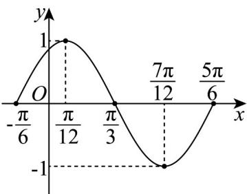

> [!faq]- 《专题15 三角函数图像变换高频题型精准突破（八大题型）（高效培优期末专项训练）》官方解析
>
> > [!success]- **【答案】** (1)无论选哪个条件，函数 $f(x)$ 的解析式均为 $f(x)=\sin\left(2x+\frac{\pi}{3}\right)$ . (2) 答案见解析
>
> > [!note]- **【分析】**
> > （1）若选①，则 $f\left(\frac{\pi}{12}\right)=\sin\left(2\times\frac{\pi}{12}+\varphi\right)=1$ ，若选②，则 $f\left(-\frac{\pi}{6}\right)=\sin\left(-\frac{\pi}{3}+\varphi\right)=0$ ，若选③，则 $\left(-\frac{5\pi}{6}+\varphi,\frac{\pi}{6}+\varphi\right)=\left(-\frac{\pi}{2},\frac{\pi}{2}\right)$ ，由此求出分别求出 $\varphi$ 即可得解.
> >
> > (2) 直接用“等距法”按照五点画图的步骤作图即可.
>
> > [!note]- **【解析】**
> > （1）由题意最小正周期为 $T = \frac{2\pi}{|\omega|} = \pi, \omega > 0$ ，解得 $\omega = 2$ ，所以 $f(x) = \sin(2x + \varphi)$ ，
> >
> > 若选①，则 $f\left(\frac{\pi}{12}\right)=\sin\left(2\times\frac{\pi}{12}+\varphi\right)=1$ ，所以 $\frac{\pi}{6}+\varphi=\frac{\pi}{2}+2k\pi,k\in Z$
> >
> > 又 $0 < \varphi < \frac{\pi}{2}$ ，所以 $k = 0, \varphi = \frac{\pi}{3}$ ，
> >
> > 所以函数 $f(x)$ 的解析式为 $f(x) = \sin \left(2x + \frac{\pi}{3}\right)$
> >
> > 若选②，则 $f\left(-\frac{\pi}{6}\right)=\sin\left(-\frac{\pi}{3}+\varphi\right)=0$ ，所以 $-\frac{\pi}{3}+\varphi=k\pi,k\in Z$
> >
> > 又 $0 < \varphi < \frac{\pi}{2}$ ，所以 $k = 0, \varphi = \frac{\pi}{3}$ ，
> >
> > 所以函数 $f(x)$ 的解析式为 $f(x) = \sin \left(2x + \frac{\pi}{3}\right)$
> >
> > 若选③，即 $f(x)$ 的一个增区间为 $\left(-\frac{5\pi}{12}, \frac{\pi}{12}\right)$
> >
> > 当 $x\in \left(-\frac{5\pi}{12},\frac{\pi}{12}\right)$ 时， $t = 2x + \varphi \in \left(-\frac{5\pi}{6} +\varphi ,\frac{\pi}{6} +\varphi\right)$
> >
> > 又 $0 < \varphi < \frac{\pi}{2}$
> >
> > 由复合函数单调性可知，只能 $\left(-\frac{5\pi}{6} +\varphi ,\frac{\pi}{6} +\varphi\right) = \left(-\frac{\pi}{2},\frac{\pi}{2}\right)$
> >
> > $\varphi = \frac{\pi}{3}$ ，所以函数 $f(x)$ 的解析式为 $f(x) = \sin \left(2x + \frac{\pi}{3}\right)$
> >
> > 综上所述，无论选哪个条件，函数 $f(x)$ 的解析式均为 $f(x) = \sin \left(2x + \frac{\pi}{3}\right)$ .
> >
> > (2) 列表如下：
> >
> > <table><tr><td>x</td><td> $-\frac{\pi}{6}$ </td><td> $\frac{\pi}{12}$ </td><td> $\frac{\pi}{3}$ </td><td> $\frac{7\pi}{12}$ </td><td> $\frac{5\pi}{6}$ </td></tr><tr><td> $t = 2x + \frac{\pi}{3}$ </td><td>0</td><td> $\frac{\pi}{2}$ </td><td> $\pi$ </td><td> $\frac{3\pi}{2}$ </td><td> $2\pi$ </td></tr><tr><td> $f(x) = \sin\left(2x + \frac{\pi}{3}\right)$ </td><td>0</td><td>1</td><td>0</td><td>-1</td><td>0</td></tr></table>
> >
> > 描点、连线（光滑曲线）画出函数 $f(x)$ 一个周期内的图象如图所示：
> >
> > 
